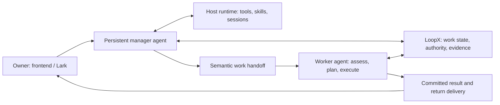

# RFC: Capable Agent Manager and Semantic Work Handoff (v0)

- **RFC status:** Draft, under maintainer review
- **Delivery maturity:** Proposal; existing foundations are identified in Section 4
- **Authors / owners:** LoopX maintainers; manager engineering owner
- **Created / last normative revision:** 2026-09-13
- **Implementation baseline:** `7eb4b7bb1661bd5eff63a8725a33169792d5964b`
- **Language mirror:** [中文版](capable-manager-semantic-handoff-v0.zh-CN.md)
- **Related contracts:** [Effect interpreter](agent-loop-effect-interpreter-v0.md), [Manager continuity](../../reference/protocols/manager-evidence-and-continuity-v0.md), [Goal Vision/Replan](../../reference/protocols/goal-vision-replan-contract-v0.md), [Desktop frontends](desktop-execution-frontends-v0.md), [Shared authority](shared-goal-authority-state-provider-v0.md)

## Document map and maintenance contract

Sections 1–3 and 5–12 are proposed normative design and acceptance requirements. Section 4 records source-audited baseline facts, not deployment claims. Appendices preserve rationale and evidence. English and Chinese are semantic mirrors. This RFC does not declare new tools, schemas, permissions or migrations implemented merely by naming them.

This is the proposed product-level successor to the staged **Manager evidence and continuity v0** design. Keep that protocol as the implementation/migration reference until individual milestones replace its restrictions. Absorb the pending same-Goal handoff design from [#4312](https://github.com/huangruiteng/loopx/pull/4312) as a migration input, not an architectural restriction. Refine the manager portions of Desktop Frontends and Goal Channel, preserving direct conversations with working Agents. Do not replace the effect interpreter, Goal Vision/Replan or shared-authority RFCs.

## 1. Decision summary

Build the manager as a **capable, persistent agent on the user's host**, using the installed runtime's normal tools and skills under the owner's durable authority. It should investigate, decide, do appropriately scoped work, and coordinate workers. Reading a repository must not require inventing a repository-specific manager protocol when ordinary file/Git/API tools already solve the task.

Build handoff as **continuation of work with semantic state**, not only forwarding a sentence or generating a Todo edit. Preserve purpose, context, decisions, constraints, evidence, current commitments and the expected return. Preserve LoopX's authoritative work semantics while refactoring their implementation into a coherent collaboration boundary. Existing module locations, file layouts and manager-only protocols are migration inputs, not constraints on the target design.

The division of responsibility is:

- The agent decides how to investigate, whom to involve and what the evidence means.
- LoopX owns accepted Goal/Todo/Vision/claim/evidence transitions and recoverable coordination.
- The runtime owns tool execution, session persistence and actual host permissions.
- Frontend and Lark are conversation/feedback entrances to the same service, scoped to their audiences.

For an authenticated owner on a configured trusted host, the intended default is useful autonomy within existing grants, including ordinary reversible work without repeated approval. Restricted/shared-audience operation remains available. Neither a message nor a capability switch silently expands OS, provider or audience authority. This RFC proposes that default change; it does not activate it.

## 2. Problem and motivation

A user asks a manager to review a change, incorporate several follow-up constraints, coordinate implementation and report back. The current experience can fail independently at each step:

| Friction | Architectural diagnosis | Required change |
| --- | --- | --- |
| A strong model repeatedly says it lacks a PR diff available through local tools | Read-only planner instructions and a narrow projected context define its effective ceiling | Give the manager normal permitted investigative tools and enough task context |
| An explicit instruction becomes a preview requiring another confirmation | Chat proposal mode is confused with the owner's already-authorized intent | Match existing authority and execute or delegate; ask only for a real missing decision |
| A routing list omits the appropriate worker | Discovery is treated as a fixed allowlist of responsibilities | Discover registered active agents, inspect roles/work and select best effort |
| A worker gets “review the points above” without the points | Original-message fidelity does not preserve conversational meaning | Carry relevant context and its provenance, alongside the original input |
| “Forwarded” is reported although the worker has not assessed it | Transport, interpretation, work and return delivery are collapsed | Preserve independent receipts and automatically return a useful conclusion |
| A complete answer is replaced by a format-error notice | User text and control output share a fragile decoding/delivery path | Separate control effects, saved answer and transport recovery |

These failures have different causes. A better model can improve investigation and routing; it cannot guarantee delivery or reconstruct missing context. A denser packet cannot compensate for a runtime forbidden to inspect the evidence it references. Both assumptions must be implemented and tested together.

### Invariants

1. One authoritative owner per kind of work state; no editable manager copy of progress.
2. Existing durable authorization is reused; genuine missing authority remains visible.
3. Read access, action permission and permission to disclose the result are distinct.
4. Receipt, assessment, plan change, completed work and delivered answer never stand in for one another.
5. A worker controls its plan and accepted commitments. Delegation does not silently interrupt it or raise priority.
6. An unresolved request survives restarts and context compaction; failures produce actionable feedback.

## 3. Scope and non-goals

Include global manager conversations, host-native investigation, ordinary authorized actions, responsibility discovery, semantic handoff, receiver planning, automatic return, cross-entrypoint visibility and recovery. Support manager→worker and worker→worker as two real consumers of the same handoff semantics.

Do not build a replacement agent runtime, a second scheduler, an external-agent marketplace, a new repository API, a universal workflow DSL or a duplicate task database. A substantial refactor of the current manager, collaboration and adapter boundaries is explicitly in scope; conserving current code volume or module names is not an acceptance goal. Do not require OpenViking, a shared online database or A2A to make local handoffs correct. Do not copy private reasoning traces or complete historical transcripts into every request. Complex financial and other domain effects remain owned by their capabilities and execution adapters.

## 4. Current-system contract: audited facts

The baseline already has substantial reusable machinery:

| Existing owner | Source / fact | Consequence |
| --- | --- | --- |
| Manager identity/config | `loopx/chat_manager.py`: `open_manager_session`, `manager_workspace`, `manager_model_config` | Stable global role, audience-derived private workspace, `resume_latest`; default Codex model is `gpt-6-astra` / `high` |
| Host execution | `loopx/chat_agent.py`: `_turn_prompt`, `CodexChatAgentSession.start`; `loopx/chat_runtime.py`: adapter creation/restoration | Codex app-server start/resume exists. Planning uses read-only sandbox and never approvals; only the manager read dynamic tool is added by this path |
| Manager behavioral restriction | `MANAGER_AGENT_OBJECTIVE` and the planning prompt | Shell/arbitrary repository reads and mutations are restricted; outside intent delegation, durable changes become preview/apply proposals |
| Session restoration | `loopx/chat_runtime.py` | Saved upstream identity is resumed when compatible; context-version and audience changes can force a new thread. This is not evidence that every deployed request resumes successfully |
| Evidence reads | `manager_context/inspection.py`, `ssh_evidence.py`, global-manager CLI | Core portfolio/Todo/delivery reads, pagination and host provenance exist; the initial projection is not full external artifact evidence |
| Context transfer | `manager_context/__init__.py` | Original ingress provenance, exact recipient, request digest, inbox and receiver hook exist; the current wire is `loopx_manager_context_entry_v1` |
| Return path | `manager_context/tracking.py`, `roundtrip.py` | Read, acknowledge, canonical Todo/evidence links, immutable reply and return transport exist; preserve these facts during replacement, without keeping duplicate transition owners |
| Semantic work state | Goal Vision/Replan protocol and typed control plane | Agent-scoped direction, acceptance, path delta, current Todos, evidence and claims already describe work beyond status labels |
| UI | `apps/presentation/dashboard/src/data/chat.ts`, `chat-model.ts`, capability settings/workbench | Existing conversation and configuration projections should expose the richer runtime and exchange |

A separate pending [#4312](https://github.com/huangruiteng/loopx/pull/4312) at `13085665a9377f160025ec6c01885e889f0df5c9` adds same-Goal agent handoff. Its proposed `agent_handoff.py` owns a Todo/from/to-derived dispatch identity and dispatched/read/claim receipts; this is outside the named `main` baseline. Treat its same-Goal, unclaimed-Todo and independent-review predicates as the semantics of that specific dispatch path, not universal rules for all work requests. Its `same-goal-agent-handoff-inbox-v0` RFC should be absorbed as a historical adapter/migration reference when this direction is accepted.

The pending [PR #4306](https://github.com/huangruiteng/loopx/pull/4306) adds a special GitHub evidence reader with revision guards, pagination, typed failure handling and routing policy. Its latest reviewed shape is read-first, so it is not merely a forwarding workaround. Nevertheless, the manager should not need this additional per-resource tool surface for ordinary host investigation. Section 6 recommends closing it as the chosen product path, retaining useful regression requirements.

## 5. Proposed architecture

### 5.1 A persistent, capable manager



Keep a neutral private manager workspace to avoid inheriting one project's identity. This is an instruction home, not the limit of knowledge. Supply the host/project catalog and let the runtime access owner-authorized repositories, documents, tools and configured hosts. Load project instructions when entering that project's work; local-repository availability does not establish its HEAD equals a remote PR HEAD.

Use the installed runtime's filesystem, shell, Git/`gh`, web and appropriate connector capabilities directly. Reuse LoopX CLI/skills for structured state; retain `loopx_manager_read` as a convenient high-quality read model, not the only knowledge channel. Domain skills teach methods. They must not become a fresh wrapper around every normal tool. An unavailable cache prompts another permitted authoritative source, not a repeated generic disclaimer. A real permission or policy denial is not treated as a cache failure to circumvent.

The manager performs short investigations and routine reversible work directly. It delegates sustained, specialized or independently owned work, and can consult workers without transferring ownership. It explains its decision when useful. It must not hand everything off merely because it is called a manager, or absorb every engineering task and become a bottleneck.

At session start, expose the effective host, model/effort, accessible resource classes, tool availability, relevant standing grants and instruction revisions. Separate configured preference from verified runtime capability. For the existing Codex adapter, keep the current strong model default; providers retain explicit equivalent profiles. Do not request hidden reasoning traces as evidence of intelligence.

### 5.2 Target boundaries: refactor around work, not the manager

The target has three product/technical owners:

1. **Manager agent application:** conversation continuity, investigation, judgment, delegation, synthesis and user feedback. Its AGENTS/skills teach LoopX state discovery and collaboration. Its ordinary tools come from the host runtime. It does not own an independent handoff ledger or invent low-level workflow steps for every user request.
2. **Core collaboration bounded context:** general work-request identity, versioned semantic context, assessment/result relations, transfer/cancellation effects and immutable receipts. Move generic transitions out of `manager_context` into the established TypeScript control plane, with one transition owner and canonical store interface. A prospective `control_plane/collaboration` boundary is a design location, not a new shipped CLI. Existing Goal/Todo/Vision authorities remain owners of their own objects; collaboration references and invokes them.
3. **Runtime and channel adapters:** discover/register agent addresses, present requests at supported loop boundaries, persist transport intents and map provider events to receipts. Codex, CLI, managed Turn, Lark and frontend consume the same collaboration semantics. Transport bookkeeping is not ownership of work completion.

A work request is first-class and may exist **before a Todo**. Consultation can resolve with a reasoned answer and evidence; accepted implementation can attach one or more existing/new Todos. Handoff can stay within one Goal, connect distinct Goals, or reach a registered host. Neither `same Goal`, `unclaimed Todo`, `source excluded`, nor an installed domain capability is a universal admission predicate. Those checks apply only to the specific effect whose contract needs them, such as an independent-review claim.

Work-request identity derives from origin plus an immutable request ID/revision. Do not use only `(goal, todo, from, to)` as universal identity: a second review round of the same Todo is new work, while retrying the same round is not. Changing recipient creates a recorded reassignment/dispatch attempt; old attempts remain reconcilable. Consultation, delegated work and ownership transfer are distinct intents expressed within this one contract, not three unrelated inbox implementations.

For a small local manager action, a current request/Turn and accepted effect receipt can be enough. Do not manufacture a Todo, target-capability, repository identity and validation command merely to read a file, answer a question or record an ordinary note. Durable implementation work still benefits from explicit tasks, scope and validation. Domain-capability checks belong to effects requiring that capability; capability registration is not universal permission to think or investigate.

The durable semantic context consists of a small typed identity/control header plus a versioned human-readable brief and resolvable work/artifact references. The header drives routing and legal transitions. The brief carries open-ended domain meaning; Core does not classify every sentence into a rigid schema. This is dense general-task state, not serialization of the model's hidden thoughts. The same context remains available when a runtime session is replaced.

Prefer one cohesive replacement to compatibility wrappers that preserve duplicate decisions. Inventory every existing producer/reader, migrate with lossless mappings, switch one writer and delete the replaced rules. Reusing contracts and data is required; reusing every current class, JSON directory and prompt is not.

### 5.3 Authority that enables work

Resolve a request from authenticated principal, origin/audience, resource scope and requested effect, then match the existing persistent grant. A grant is reused across turns and restarts until revoked, expired or outside scope. Authorized delegation may carry an attenuated reference to a real standing grant; handoff is not inherently powerless. The receiver verifies the grant chain, target/action scope and its own host authority. It neither trusts a model-written permission string nor requires the user to approve the same in-scope work again. Read-only discovery, direct reversible effects and protected operations keep their actual permission semantics; none is forced through a second confirmation merely because the entrypoint is chat.

For a trusted owner-private manager, grant the normal host-agent tool profile that the owner configured. For a shared/untrusted audience, run a restricted context with enforceable resource/tool limits. A broad private process followed only by output filtering is **not** sufficient isolation. A verified owner message in a group may trigger private work with a separately scoped return, when a standing policy permits it; other participants do not inherit that policy.

LoopX state mutations always use the existing typed command boundary, even if initiated through shell. The manager does not edit registry/authority files behind the control plane. Repository modifications use the project's normal worktree/review practice. Scoped merge/deploy authorization may be reused; unrelated payment or trading authority cannot be inferred from it.

If an approval bridge is needed, it presents the exact operation and existing grant mismatch and waits for a real answer. A noninteractive `approvalPolicy=never` rejection must not be misreported as the user refusing. Host policy, provider rejection and application restrictions remain separate diagnoses. This design does not attempt to bypass an upstream safety decision.

### 5.4 Semantic density: preserve what changes the next decision

LoopX state is richer than a task queue. A handoff should enable the receiver to reconstruct **why the work exists, what is true, what remains uncertain and what it may change**, using current authoritative objects plus durable contextual material. Density means useful decision relationships, not maximum text length or a giant schema.

The proposed handoff read model composes the following; these are semantic slots, not a requirement to create a new persisted field for each row:

| Slot | Meaning / owner |
| --- | --- |
| Identity and causality | Stable request, conversation/origin event, parent request, handoff revision, exact sender/receiver and return route; host/control-owned |
| Intent and expected outcome | Original user input plus a faithful operational summary and completion question; source-labelled, not a new permission grant |
| Relevant conversational context | Referenced messages/documents, subsequent corrections, source/digest and summary provenance; not unrelated transcript history |
| Current work and commitments | References to Goal, Agent Vision, Todos, dependencies, claims/leases and accepted milestones at known revisions |
| Decision context | Relevant alternatives, rejected paths, constraints, assumptions, uncertainties and rationale summaries; author/confidence/evidence distinguished |
| Evidence and access | Locators, source revision/time, verified vs recorded claim, scope and actual read status; a hash alone is not a fetchable artifact |
| Change request | What new information asks the receiver to reconsider; what must be retained; desired urgency vs an authorized priority change |
| Result contract | Required decision/work/artifacts, permitted audience, next condition if deferred, and who owes the eventual answer |

Reuse immutable source messages, current work objects and artifact references. Store a concise semantic brief only for information not already represented, with revision and provenance. Machine authority comes from typed accepted commands; neither quoted material nor a model-written summary is an authority token. User requests inside source messages are distinguished from third-party quoted instructions.

Do not put the entire handoff inside Goal Vision's bounded summary or expand every TurnEnvelope by the size of the source corpus. Keep the prompt projection small and task-adaptive; pin the brief and unresolved constraints, and provide real permitted drill-down to the full source. A projection must disclose omissions. Reject oversized writes explicitly or externalize them through the existing artifact owner; never silently remove a user constraint. This RFC does not change existing field budgets.

### 5.5 Responsibility discovery and receiver-owned planning

Discover all registered active Goals and their agents within authorized host scope. Stopped Goals are excluded by default but can be requested. Discoverability, read access, context delivery and execution permission are four separate facts. “Best effort” means the manager investigates role, current work, repository and availability; it does not mean broadcasting private context or guessing an identity.

Prefer the explicitly named receiver; otherwise resolve the best responsible agent from current state. A missing convenience routing profile must not make a known authorized worker nonexistent. Avoid fixed per-request catalogs as the only responsibility model. If several agents fit, choose an assessment owner and say why; clarify only when ambiguity materially changes authority or outcome. If no worker is suitable, do the permitted work locally or report the actual missing capability. Do not silently start a new user task or wake a stopped Goal.

The receiver gets the packet at a supported safe interaction boundary. The existing turn-start hook is the baseline; an attached runtime may support prompt delivery at its next safe continuation point. Always publish whether the target is reachable, queued until wake, or unsupported. Inbox storage does not prove injection into a model session, and injection does not prove adoption.

The receiver compares the new request to current state, records adopted/partially adopted/deferred/rejected with a concise reason, and applies any plan change through its own canonical Todo/Vision workflow. `partial` must identify the accepted and unresolved parts. A deferred outcome names a resume condition and owner; it must not silently close an execution request still owed. Explicit cancellation/reprioritization requires the corresponding current authority and receipt.

### 5.6 One exchange, independent durable facts

The user-facing exchange is **received → assessed/working → result**, with meaningful updates when needed. Internally, keep transport and work facts separate:

| Fact | Evidence required |
| --- | --- |
| Accepted at ingress | Durable source/request identity; no claim the worker has read it |
| Delivered to receiver inbox | Exact target and persisted payload revision |
| Presented to a worker turn | Host receipt for that request/revision and runtime turn; legacy `read` is not proof of comprehension |
| Assessed | Receiver decision, accepted scope, plan/evidence references or specific deferral |
| Work resolved | Result satisfies the request's completion question, or an explicit rejection/cancellation/terminal inability |
| Answer delivered | Provider receipt/readback for the original route and answer revision; distinct from resolution |

Migrate current inbox/tracking/roundtrip records into the single collaboration owner; preserve their valid effect semantics and receipts, but retire duplicate manager-specific transition logic after cutover. Persist intent before dispatch; use request revision plus effect identity for idempotency. A changed payload cannot reuse an immutable identity; a correction appends a linked revision and the receiver rechecks relevant state before effectful execution. Multiple messages about one job may be explicitly related by the manager, preserving each original obligation and correction. Do not merge independent same-text requests by a content hash alone.

At-least-once delivery with idempotent Core effects is the target. Do not promise exactly-once external effects: uncertain sends are reconciled using provider receipts before retry. Concurrent workers use existing claims/leases; delegation does not claim the worker's Todo. Cross-host operation uses configured transport and authority, not a bare local path copied to another machine.

The receiver commits result/evidence links and audience-ready text. The manager may synthesize multiple worker outcomes into one answer, maintaining request-level coverage. A deterministic outbox delivers an already committed result even if the manager model is unavailable. If synthesis is required, persist that duty; do not let an optional synthesis step erase the worker's result. Model retries never replay an already accepted action.

### 5.7 Session and product continuity

One manager identity has logical conversations scoped by audience/authority. Resume a compatible upstream thread in the same runtime home. Refresh current Core state and pending requests every turn; session memory is not current truth. On incompatible scope/tool changes or missing sessions, recover from durable context with a recorded reason, preserving unresolved work. Do not restart simply to reapply ordinary context; do not import runtime database rows across homes.

Frontend and Lark share request/result identity and authorized facts. Equivalent authorized surfaces may show the same conversation; other groups must not receive private history. The frontend shows conversation, worker, brief, current work/result and delivery status. A saved answer not delivered to Lark is visible as such and is recoverable without rerunning work. Lark shows timely receipt, substantive result and necessary next action; multi-part output or a readable attachment preserves lengthy content. It must not force the user to ask where every handoff went.

Keep protocol effects separate from visible text. Reuse host tool/function calls and typed receipts for actions where supported; a compatibility decoder must quarantine malformed control envelopes while recovering independently valid display text. Never infer or execute an effect from a recovered answer. Formatting failure is a transport incident, not new work for the model.

### 5.8 One concrete exchange across several messages

A user asks to review a capability PR, then adds “keep lifecycle behavior in hooks; preserve enough context; have the engineering agent implement the conclusion.” The manager reads the repository and actual PR through normal tools, relates the follow-up messages, and keeps the distinction between verified findings and requested design preferences. If the work merits delegation, the semantic brief includes the exact review target/revision, all three constraints, evidence, current accepted commitments and the required return: a review decision plus implementation/validation outcome.

The engineering worker reads the brief and current state, checks its own authority, adopts or contests the design, and updates its plan. New findings may justify a different implementation; they do not justify silently forgetting a user constraint. Its result links the work, validation and remaining limitations. The original conversation receives that result automatically, even after reconnect. A subsequent user correction becomes a linked revision, not a second disconnected queue entry or an overwrite of an already executed decision.

The same contract works when a research worker asks another worker to countercheck a source: no repository or existing Todo is required to express the question, disagreement and evidence. That second consumer is the concrete test that the abstraction is about general work rather than a manager-branded router.

### 5.9 Replacement map and refactor acceptance

| Current seam | Target | Retirement condition |
| --- | --- | --- |
| Manager inherits Chat planning-only restrictions and JSON preview fallback | Dedicated capable-manager role using native host tools and accepted effect receipts; keep explicit plan-only mode for users who select it | M1 proves ordinary authorized actions and restricted-mode parity; remove contradictory manager instructions |
| Manager context inbox plus same-Goal Todo-handoff rules | One collaboration work-request contract with referenced semantic context and intent-specific admission | M2 lossless migration and two-consumer conformance; remove duplicate identities and transitions |
| `manager_context` owns generic dispatch/decision semantics in Python | Core TypeScript collaboration domain; Python calls the typed boundary and adapts runtime/channel I/O | Switch one writer after differential tests, then delete the old decision implementation |
| Fixed capability-specific recipient list | Current agent discovery plus intelligent responsibility resolution and real authorization checks | M2 covers missing profiles, cross-Goal work and explicit unavailable targets |
| Inline response text doubles as action protocol | Host tool/effect events plus separate saved human answer; legacy decoder only during the migration window | M3 validates interrupted output and effect idempotency, then retires producer use of embedded control text |
| Manager-specific result return pipeline | Channel-neutral committed result/outbox contract; Lark/Web render and acknowledge | M3 proves automatic return and restart reconciliation without a model rerun |

Do not migrate every LoopX subsystem in this program. The refactor slice is manager role, collaboration request/assessment/result and their real adapters. It may remove substantial old code, but does not absorb quota, finance methods or the entire runtime into a new orchestrator. Preserve characterized legitimate behavior while intentionally changing the old restrictions described here; parity tests must not freeze those restrictions as desired behavior.

### 5.10 Minimum contract and legal observations

The following is a **proposed contract**, not an implemented schema or command. M2 finalizes names and serialization, but must preserve these semantics:

```text
WorkRequest {
  request_id, revision, origin_ref, sender_ref, intent,
  target_ref?, authority_ref, context_ref, return_ref,
  work_refs[], supersedes_ref?
}
SemanticContext {
  revision, digest, brief, source_refs[], work_revision_refs[],
  access_scope_ref, omissions[]
}
Observation {
  event_id, request_id, request_revision, actor_ref, event_kind,
  evidence_refs[], result_ref?, recorded_at
}
```

`request_id` identifies the exchange, `revision` is monotonic and immutable once committed, and `origin_ref` resolves to authenticated source provenance. `intent` distinguishes consultation, delegated work and ownership transfer. `target_ref` may be absent only before assignment. The authority reference binds the originating principal's current grant scope; it is resolved independently of the brief. `return_ref` names a principal/audience-scoped result sink or parent request, **not necessarily a manager session**. An empty work-reference list is legal: request acceptance must not require a Todo. `context_ref` resolves to a revision/digest plus the minimal brief: desired outcome, active constraints and known unknowns. Source and work references identify their access scope and known revision; unknown versions are explicit. No raw credential or hidden reasoning is a field.

Validate reference access before presenting context. A summary may be model-authored but retains its sources, authorship and revision; a host validates envelope identity and authority. Oversized context is retained as an access-controlled artifact and a disclosed projection; if it cannot be stored/read, reject with a recoverable context error rather than claim a complete handoff. Existing summaries need no global budget increase.

State is projected from accepted observations along independent axes:

| Axis | Legal evolution and invariant |
| --- | --- |
| Assignment/delivery | unassigned → assigned → inbox-persisted → presented; reassignments create attempt identities; presentation names an actual host turn, not a CLI fetch alone |
| Assessment/work | pending → accepted / partially-accepted / deferred / rejected; accepted work may run and resolve; deferred remains open with a condition; accepted is not completed |
| Control requests | correction / cancellation / expiry are recorded requests or conditions; cancellation becomes effective only at an acknowledged safe boundary, expiry prevents new dispatch but does not undo an in-flight external effect |
| Result delivery | absent → result-committed → pending-send → sent-verified; failed or uncertain sends retain the result; uncertainty requires reconciliation |

Every observation is appended once by event identity with compare-and-set on the request revision. Repeated identical events return the prior receipt; changed payload under that identity conflicts. Core effects return accepted/rejected/conflict/already-applied observations through the existing effect-interpreter seam. Reassignment cannot erase an active execution claim. If the old worker is unreachable, record the uncertainty and preserve the claim until its existing lease/transfer rules permit another executor.

A durable pending request carries a next wake/recheck condition through the existing host scheduling owner. Busy, offline, unsupported delivery, dependency wait and missing input are explicit observations, not repeated model polls. When deferred work becomes eligible, wake or present it once through the supported adapter. A result can be terminal failure/rejection, but incomplete work is not converted into success merely to empty the inbox.

All participants can publish results and inspect their authorized requests; generic collaboration and the outbox do not depend on the manager process. For worker→worker, the return sink can be the originating worker and its parent exchange. The manager is optional synthesis and presentation, not the lifecycle coordinator of every collaboration.

For shell/Git/API effects outside Core, use an effect-intent ID and the provider's idempotency/readback when available. Persist a completion observation only after evidence. A crashed command whose effect is unknown is reconciled before another effectful attempt; lacking an idempotent API is not permission to replay it. The manager's ordinary tools gain freedom, not a false exactly-once guarantee.

## 6. Alternatives and disposition of #4306

- **Choose normal runtime tools + LoopX semantic state.** It preserves agent flexibility and reuses existing tooling. Its cost is real host-profile qualification and clear private/shared-scope isolation.
- **Do not make a growing list of dedicated evidence tools the primary manager design.** #4306 solves real revision, coverage and routing problems, but its special GitHub reader duplicates mature tools while leaving the restrictive manager shape intact. Close that PR as the default-path solution. Keep its regression cases for revision drift, unavailable sources, responsible routing and private-scope leakage; port only cases exercised by the replacement path.
- **Retain optional bounded readers where the environment needs them.** A shared group, remote read-only service or minimal host can use the existing portfolio reader or a connector. This does not justify forcing the trusted local owner through it.
- **Reject pure prompt expansion and raw-message forwarding as sufficient fixes.** They cannot establish delivery, preserve all referenced context or commit state safely.
- **Reject a new universal workflow/state database.** Replace fragmented handoff owners with one typed collaboration context, referencing existing work authority. Qualify it with manager→worker and worker→worker on the same conformance tests; do not retain a manager-only architecture by default.

Closing #4306 does not close its underlying user problem. Its issue remains linked to M1/M2 until direct investigation and responsibility routing pass live acceptance. No new protocol is justified solely by having written a large RFC.

## 7. Safety, privacy and compatibility

The trust boundary is principal/resource/effect/audience, not “Lark is always untrusted” or “same machine means everything is public.” High autonomy is valuable only with an enforceable host profile. Keep credentials in the existing runtime store and raw private source material outside public projections. Untrusted repository/web content is data; it cannot update standing grants or manager instructions.

Version semantic briefs and reference manifests. Preserve existing stored fields and unknown historical facts; no synthetic read/adoption times. A correction does not rewrite an old conclusion. A fresh conclusion may supersede one with an explicit link. Permission revocation prevents new use/disclosure and invalidates incompatible conversation context, while retaining access-controlled audit records.

Feature-off/restricted-mode behavior stays testable. Existing grants are migrated by exact semantics, never widened by “manager enabled.” Revocation, provider errors and missing host features produce concrete repair guidance. Routine read failures should not block unrelated authorized work.

## 8. Migration and rollback

1. Inventory current runtime/profile, session mapping, grants, pending inbox entries and outbox deliveries. Establish baseline journey fixtures before changes.
2. Introduce the capable manager profile through existing configuration ownership; promote for trusted owners only after effective-permission readback. Reuse a sufficient existing grant; request a one-time profile decision only if no such grant exists. Retain an explicit restricted profile.
3. Introduce the general collaboration contract and map existing manager and same-Goal handoff records losslessly; keep old readers during a bounded migration window. Legacy records expose missing semantic context as unknown and remain readable/deliverable. New producers must not require unsupported receivers; negotiate or render a compatible semantic brief without dropping obligations.
4. Move shared lifecycle transitions into the established typed owner with characterization/parity tests. Keep Python/provider code as adapters. Shared database adoption is a separate project, not a prerequisite.
5. Quiesce only the affected dispatch lane before switching its single writer. Reconcile committed requests/results before activation. Preserve source IDs, pending state and old-reader snapshots.
6. Roll back the runtime profile independently from handoff delivery. Disable new writes before returning to an older schema reader; drain/export incompatible records rather than silently losing fields or replaying work. Report unsupported downgrade explicitly.

### Required legacy mapping

M0 inventories actual fields and producers; the following mapping is the migration acceptance floor, not evidence that a migrator exists:

| Legacy record family | New meaning / preservation rule |
| --- | --- |
| Ingress and manager entries | Preserve source/request IDs, original text, digests, sender, target and exact return scope; introduce a deterministic migration alias, never redispatch |
| Read/decision records | Preserve original times and `adopt/defer/reject/no_change`; map reads to context-provided unless a host-turn receipt exists; preserve `no_change` as a decision, not failed work |
| Todo/evidence links | Preserve all links and source revisions; absent Todo remains legal; a link alone does not verify an artifact |
| Conclusions and return receipts | Preserve immutable audience-ready text, phase, identity, send attempts and ambiguous/pending outcomes; do not re-emit verified sends |
| Pending #4312-style peer records | Preserve the original tuple-derived dispatch identity as a legacy alias and its claim receipts; new rounds use new request IDs, not that old tuple |
| Unrecognized stored fields | Preserve access-controlled legacy payload plus its digest; explicitly map before dropping any field; unknown history is never fabricated |

Run old/new read-model comparison over synthetic records in every lifecycle state, including no-change, partial/legacy unknown, crash-after-effect and scope revocation. During cutover one writer owns each request; old readers are compatibility projections, not parallel authorities. A restore must reconcile outbox/claims and preserve newer records before switching back. Rollback cannot undo external effects.

## 9. Validation and acceptance

The following IDs are durable acceptance anchors for engineering Todos and PRs. They define future tests; this RFC does not mark them passed.

| ID | Journey / required evidence | Pass condition |
| --- | --- | --- |
| A1 | Owner asks about a real local repository and remote PR | Manager independently reads normal tools, pins actual revision and gives an evidence-backed answer without a special PR provider |
| A2 | Local cache unavailable; alternate permitted source works | Manager completes the investigation; real denial is reported accurately and not circumvented |
| A3 | One persistent grant, two requests and a runtime restart | Permitted work proceeds without repeat approval; revoked/out-of-scope actions do not |
| A4 | Active worker absent from convenience routing profile | Current registered responsibility is discovered; correct authorized receiver selected; stopped targets remain excluded |
| A5 | Three linked user messages including a correction and prior rejected approach | Receiver explains the intended change, preserved constraints and actual Todo/Vision consequence without asking the user to retype context |
| A6 | Manager→worker and worker→worker run the same handoff fixture | Same identity, revision, assessment, state links and return semantics, including cross-Goal consultation without an initial Todo and a second review round of one Todo; no second task database |
| A7 | Duplicate ingress, correction/cancellation during execution, concurrent claim, repeated same-Todo review and crash after a non-Core effect | No duplicate accepted effect; revision conflict is reconciled; no silent priority/ownership override |
| A8 | Worker finishes while manager/transport restarts | Result survives; original audience receives it automatically; ambiguous send is reconciled, not blindly repeated |
| A9 | Long response and truncated protocol trailer | Full valid answer is preserved and recoverable; no leaked protocol, lost obligation or replayed action |
| A10 | Owner frontend and authorized Lark conversation | Consistent request facts; truthful queued/assessed/resolved/delivery states; different audiences remain isolated |
| A11 | Registered SSH host unavailable or older receiver | Coverage and pending route are explicit; local mentions do not pretend to be remote evidence; recovery resumes correctly |
| A12 | Model/session/tool-profile upgrade | Compatible session resumes; incompatible recovery preserves constraints and pending requests; effective configuration is visible |

Run deterministic transition/compatibility tests, real installed-runtime qualification, then real frontend/Lark roundtrips with synthetic safe tasks and an authorized private canary. Record runtime/source versions and emitted receipts. Include mobile Lark and packaged frontend render/readback; backend tests alone do not pass A10. Provider receipt ambiguity and offline failure cases are required, not optional happy-path add-ons.

## 10. Operational contract

Measure ingress acknowledgement latency, first substantive response, handoff assessment latency, result-to-delivery latency, repeated-confirmation rate, unresolved requests and incorrect routing. Report attempted/verified/omitted source coverage and configured/effective permissions. Do not reward message counts or queue movement as completed work.

Target an ingress receipt within two seconds on a healthy local service, independently of model latency; this is an initial SLO to measure, not a model-response promise. Long work announces an actionable delay rather than emitting periodic noise. Cap model concurrency and per-turn investigation cost through existing runtime/Goal configuration; the manager's budget must not consume all worker capacity. Busy workers retain accepted work; queuing and next wake are visible.

Use existing service recovery and receipt pumps. No manager-specific business automation for each kind of request. Expose configuration and failures through the existing CLI, capability settings and manager conversation. Troubleshooting distinguishes model failure, tool/policy denial, state conflict, unreachable receiver and transport formatting/delivery failure.

## 11. Normative delivery plan

Implement coherent end-to-end slices, not one PR per incidental field. The manager engineering owner maintains canonical Todos and a private incident-to-acceptance map; PRs link this RFC milestone and acceptance IDs. Public progress updates contain only safe results. Milestone completion requires current deployment evidence, not merged PR count.

| Milestone | Shipped behavior and ownership | Entry / exit evidence | Rollback |
| --- | --- | --- | --- |
| M0 — reconcile direction | Manager capability owner inventories current restrictions, grants, sessions and pending exchanges; closes superseded #4306 path and maps surviving fixes | Existing fixtures + public decision link + no orphaned request; no runtime claim | Documentation/proposal only |
| M1 — useful host agent | Manager capability + runtime adapter use ordinary tools/skills and persistent owner grant; frontend exposes effective profile/session and failures | A1–A3, A12 on real installed runtime; portfolio remains reusable; no per-resource wrapper required | Restore restricted profile, preserve requests |
| M2 — semantic continuation | Core collaboration replaces manager-specific handoff transitions; requests work before a Todo and across Goals; semantic brief and discovery connect to receiver-owned planning; both consumers qualify the same contract | A4–A7 and A11; compare old/new records and preserve fields; TS owns shared transition rules | Disable new producer, retain compatible readers and pending results |
| M3 — automatic complete exchange | Receiver conclusion + existing outbox + frontend/Lark visibility, safe rich output and restart recovery | A8–A10; failure injection and live readback; user receives conclusion without querying | Keep result store, switch transport/profile without replay |
| M4 — promotion and retirement | Three heterogeneous active Goals, owner + shared-scope and configured SSH journeys pass; obsolete manager restrictions/compatibility seams removed | All acceptance rows, permission regression and measured SLO/cost; document remaining unqualified hosts | Scoped rollback with schema-aware drain/export |

M1 need not wait for a generic handoff refactor. M3's independent format/delivery fixes may ship early using the existing inbox. M2 promotion needs the second consumer; it must not hold a useful manager-only improvement hostage. No milestone creates an extra user confirmation for routine research or normal delegation.

Each implementation Todo declares target capability, repository, write scope, validation command, RFC milestone, acceptance IDs and dependencies. Prefer extending existing Todos; supersede obsolete ones with lineage. Separate LoopX core transition work, manager capability/runtime work, frontend/Lark work and domain-adapter work. Domain recipes remain outside this generic RFC. The engineering owner reports the accepted scope and next milestone, then the delivered outcome and evidence automatically.

## 12. Open decisions

1. **Trusted-host profile defaults:** maintainers own promotion. Recommend using the effective owner runtime profile with explicit resource/audience binding, not a new manager ACL language. Before M1, qualify actual read/write/network/approval behavior and migration from existing grants.
2. **Generic handoff API placement:** typed control-plane and manager capability owners map existing storage/transactions before M2. Recommend one coherent TypeScript collaboration boundary replacing manager-specific handoff ownership; exact type/module names and the lossless storage mapping follow characterization, not this prose.
3. **Delivery SLOs and context budgets:** manager engineering owner measures M1/M3 latency and constraint retention. Keep current budgets until evidence shows a specific bottleneck; amend both language versions for normative changes.

These are engineering decisions to resolve within authorized scope and record in review; they are not new routine owner gates. Permission expansion and incompatible migration still require their actual existing authority.

## Appendix A: Research and decision basis

- [Server-client product shape](../../product/foundations/server-client-product-shape.md): LoopX is durable work authority; executor intelligence and runtime tools remain outside the store. This RFC changes the manager's restrictive role, not that separation.
- [Agent-loop effect interpreter](agent-loop-effect-interpreter-v0.md): every interpreted effect returns an observation. Handoff and return should fit that loop, rather than grow disconnected task states.
- [Agent IM collaboration](agent-im-openviking-collaboration-v0.md), [Shared authority](shared-goal-authority-state-provider-v0.md): transport, context and state authority differ; a stronger local manager does not require promoting a remote state provider.
- [Codex App Server architecture](https://openai.com/index/unlocking-the-codex-harness/): the runtime already supplies tools, skills, durable threads and streamed events. Reuse it as the host rather than recreate those capabilities in manager-only APIs.
- [A2A specification](https://a2a-protocol.org/dev/specification/): message/context/task, status and artifacts are useful comparison concepts. This RFC borrows the separation of communication and work outcomes, not an A2A dependency or a new transport mandate. The linked development specification is not pinned implementation authority.

The external sources inform the design; they do not prove LoopX behavior. The named LoopX baseline and its source paths support Section 4. Private incident transcripts and account information are excluded.

## Appendix B: Decision and execution ledger

2026-09-13: proposed a capable manager plus semantic continuation direction and a substantial collaboration-boundary refactor, with #4306 closure recommended as the superseded implementation path. Existing reply-recovery and responsibility-discovery fixes remain useful. No acceptance row, host-profile promotion or handoff schema migration is claimed delivered by this document.

Record future decisions as dated links to reviewed changes, naming the normative sections affected. Preserve previous source revisions and unresolved requests. Do not turn an append-only delivery log into an alternate task authority.
