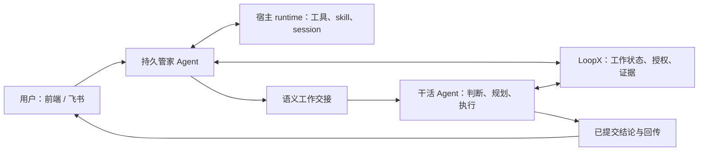

# RFC：强能力 Agent 管家与语义工作交接（v0）

- **RFC 状态：** Draft，待维护者审阅
- **交付成熟度：** 提案；已有基础见第 4 节
- **作者 / 责任人：** LoopX 维护者、管家工程负责人
- **创建 / 最近规范修订：** 2026-09-13
- **实现基线：** `7eb4b7bb1661bd5eff63a8725a33169792d5964b`
- **语言镜像：** [English](capable-manager-semantic-handoff-v0.md)
- **相关契约：** [Effect interpreter](agent-loop-effect-interpreter-v0.zh-CN.md)、[管家连续性](../../reference/protocols/manager-evidence-and-continuity-v0.md)、[Goal Vision/Replan](../../reference/protocols/goal-vision-replan-contract-v0.md)、[桌面入口](desktop-execution-frontends-v0.zh-CN.md)、[共享权威](shared-goal-authority-state-provider-v0.zh-CN.md)

## 文档地图与维护约定

第 1–3、5–12 节是拟议的规范、设计与验收要求。第 4 节是源码核验的基线事实，不代表本机部署情况。附录保存依据和决策历史。中英文互为语义镜像。本文命名的工具、类型、权限和迁移，不因此成为已实现能力。

本文拟成为 **Manager evidence and continuity v0** 分阶段设计的产品主线后继。旧协议保留实现事实与迁移参考，直到各里程碑实际替换其中的限制。把 [#4312](https://github.com/huangruiteng/loopx/pull/4312) 中待合并的 same-Goal handoff 设计作为迁移输入吸收，而不是新架构约束。相应细化 Desktop Frontends、Goal Channel 的管家部分，保留用户直接与干活 Agent 对话的路径；不替换 effect interpreter、Goal Vision/Replan 和共享权威 RFC。

## 1. 决策摘要

把管家做成**运行在用户主机上的强能力、持久 Agent**：在用户的持续授权内使用已有运行时的普通工具和 skill，自主调查、判断、完成适当范围的工作、协调干活 Agent。本机文件、Git 或已有 API 工具能解决的仓库阅读，不应先要求增加管家专用的仓库协议。

把 handoff 做成**带语义状态的工作续接**，而不只是转发一句话或生成 Todo 修改。保留目的、背景、已作决策、约束、证据、当前承诺和期望回报。保留 LoopX 的真实工作语义，同时把实现重构为清晰一致的 collaboration 边界。当前模块位置、文件布局、管家专用协议是迁移输入，不是设计上限。

职责划分：

- Agent 判断如何调查、找谁协作、证据意味着什么。
- LoopX 保存被接受的 Goal/Todo/Vision/claim/evidence 变化，保证协调可恢复。
- 运行时负责工具执行、会话持久化和真实主机权限。
- 前端、飞书是同一管家服务的对话和反馈入口，按受众隔离。

对于已配置可信主机的已认证主人，目标默认是：在现有授权内充分自主，普通可逆工作不反复确认。保留受限或共享受众模式。消息或 capability 开关不自动扩大操作系统、provider 或受众权限。本文提出默认行为变化，不立即开启它。

## 2. 问题与动机

用户让管家 review 一项改动，连续补充约束，再协调实施、自动汇报。目前每一步都可能单独失效：

| 摩擦 | 架构归因 | 应当改变什么 |
| --- | --- | --- |
| 强模型反复说看不到本机工具能取得的 PR diff | 只读 planner 指令和狭窄投影限制了实际能力上限 | 给普通、被允许的调查工具和足够上下文 |
| 明确要求执行，却变成需要再确认的预览 | Chat 提案模式与用户已经授权的意图混淆 | 匹配现有授权后执行或委托；只询问真正缺失的决策 |
| 目录漏掉正确的干活 Agent | 把发现目录当成固定职责白名单 | 发现注册的活跃 Agent，读职责和在做的事，尽力选对 |
| 接收方只拿到“看上面几点”，却没有那几点 | 保留原句不等于保留对话语义 | 原始输入与相关上下文及来源一起交接 |
| 说“已交给”，实际对方还未判断 | 混淆消息投递、理解、工作和回报 | 分开保存事实，自动返回有用结论 |
| 完整答案被格式错误通知替代 | 展示正文和控制输出共用脆弱解码、投递链路 | 分离控制效果、已保存答案和传输恢复 |

这些不是同一个问题。更强模型能改善调查和路由，却不能保证投递，也不能恢复根本没有交接的上下文。更稠密的包也无法补偿“运行时禁止读取包所引用证据”。两个前提必须一起落实、一起验收。

### 不变量

1. 每种工作状态只有一个权威 owner，管家不另存一份可编辑的真实进度。
2. 复用持续授权，真实缺失的权限才需要明确处理。
3. 能读、能做、能把结果告诉谁，是不同的权限事实。
4. 收到、判断、改计划、完成工作、送达答案，不能互相冒充。
5. 接收方掌握自己的计划和已接受承诺；交接不悄悄打断或提高优先级。
6. 未解决请求在重启、压缩上下文后仍存在；失败须有可行动的反馈。

## 3. 范围与非目标

包含全局管家对话、本机工具调查、普通授权操作、职责发现、语义交接、接收方重规划、自动回报、跨入口可见与恢复。以管家→worker、worker→worker 为同一交接语义的两个真实消费者。

不重造 Agent runtime、第二套调度器、外部 Agent 市场、新仓库 API、通用工作流 DSL 或任务数据库。明确允许对现有管家、协作和 adapter 边界大幅重构；保住现有代码体积或模块名字不是验收目标。本地交接正确性不依赖 OpenViking、在线共享数据库或 A2A。每个请求不携带私人推理轨迹和完整历史。复杂金融等垂域效果继续归各 capability 和执行 adapter。

## 4. 当前系统：已核对的基线事实

已有大量基础应该复用：

| 现有 owner | 源码 / 事实 | 含义 |
| --- | --- | --- |
| 管家身份与配置 | `loopx/chat_manager.py`：`open_manager_session`、`manager_workspace`、`manager_model_config` | 稳定全局角色、按受众派生的私人工作区、`resume_latest`；Codex 默认 `gpt-6-astra` / `high` |
| 宿主执行 | `loopx/chat_agent.py`：`_turn_prompt`、`CodexChatAgentSession.start`；`loopx/chat_runtime.py` 的 adapter 创建与恢复 | 已有 app-server start/resume；planning 使用 read-only sandbox、never approval；该路径仅额外注入 manager read 动态工具 |
| 管家行为限制 | `MANAGER_AGENT_OBJECTIVE` 和 planning prompt | 限制 shell、任意仓库阅读和写操作；除意图委托之外，持久修改走 preview/apply 提案 |
| 会话恢复 | `loopx/chat_runtime.py` | 兼容时恢复保存的 upstream 身份；上下文版本、受众变化可迫使新建线程。不能据此宣称每次线上请求都成功 resume |
| 证据读取 | `manager_context/inspection.py`、`ssh_evidence.py`、global-manager CLI | 已有 Core portfolio/Todo/delivery、分页、主机来源；初始投影不是外部产物全文 |
| 上下文转交 | `manager_context/__init__.py` | 已有原始 ingress 来源、精确接收方、请求摘要、inbox、接收 hook；当前记录为 `loopx_manager_context_entry_v1` |
| 回报 | `manager_context/tracking.py`、`roundtrip.py` | 已有 read、acknowledge、canonical Todo/evidence 链接、不可变回复与回传；应扩展这些 owner |
| 工作语义 | Goal Vision/Replan 协议与 typed control plane | Agent 方向、验收、path delta、Todo、证据、claim 已超出简单状态标签 |
| UI | `apps/presentation/dashboard/src/data/chat.ts`、`chat-model.ts`、capability settings/workbench | 通过已有对话、配置投影展示更完整的运行态与交接 |

另一项待合并的 [#4312](https://github.com/huangruiteng/loopx/pull/4312)，head 为 `13085665a9377f160025ec6c01885e889f0df5c9`，增加 same-Goal agent handoff。其拟议 `agent_handoff.py` 保存基于 Todo/from/to 的 dispatch 身份以及 dispatched/read/claim 回执；这些不在上述 main 基线中。同 Goal、未 claim Todo、独立 review 等条件仅代表该特定派发路径，不是所有工作请求的通用规则。新方向被接受后，应将其 `same-goal-agent-handoff-inbox-v0` RFC 吸收为历史 adapter/迁移参考。

待合并的 [PR #4306](https://github.com/huangruiteng/loopx/pull/4306) 增加了有版本约束、分页、typed 错误和路由规则的 GitHub 专用 reader。已核对的最新形态是先读再交接，不能把它误述成单纯转发 unknown 的补丁。但普通主机调查不应依赖再加一层按资源定制的管家工具。第 6 节建议关闭这条产品实现路线，保留有价值的回归要求。

## 5. 设计

### 5.1 持久而有能力的管家

保留中性的私人管家工作区，避免继承某个项目的身份。这是指令所在位置，不是知识范围的围栏。提供主机、项目目录，让 runtime 使用主人授权的仓库、文档、工具和已配置主机。进入项目工作时加载该项目规范；本地仓库存在不代表其 HEAD 等于远端 PR HEAD。

直接使用安装好的 runtime 的文件、shell、Git/`gh`、web 和适当 connector。结构化状态复用 LoopX CLI/skill；`loopx_manager_read` 仍是优质便捷投影，但不再是唯一知识来源。垂域 skill 教方法，不替每个普通工具再造一层包装。缓存取不到，就使用另一个被允许的权威源，而不是循环输出笼统免责声明；真正的权限或策略拒绝不能伪装成缓存故障来规避。

管家自己完成短调查和普通可逆工作；持续、专业或已有责任人的工作交给 worker，也可以先咨询而不移交所有权。必要时说明判断依据。既不能因为叫管家就把所有事都转走，也不能吞掉所有工程任务成为瓶颈。

会话启动时提供实际主机、模型/effort、可访问资源类别、工具可用性、相关持续授权和指令版本。配置偏好与运行时已验证能力分开。现有 Codex adapter 保留强模型默认，其他 provider 使用明确的等价 profile；不要求提供隐藏推理轨迹来证明智能。

### 5.2 目标边界：围绕工作重构，不围绕管家堆实现

目标分成三个产品/技术 owner：

1. **管家 Agent 应用：** 负责对话连续性、调查、判断、委托、综合和用户反馈。AGENTS/skill 教它使用 LoopX 状态发现与协作；普通工具来自 host runtime。不独占另一份 handoff 账本，也不替每句用户需求发明底层工作流步骤。
2. **Core collaboration 有界上下文：** 负责通用工作请求身份、版本化语义背景、评估/结果关联、移交/取消效果和不可变回执。把通用转移从 `manager_context` 移到已有 TS 控制面，保持一个转移 owner 和 canonical store 接口。拟议 `control_plane/collaboration` 是设计位置，不是现有 CLI。Goal/Todo/Vision 仍各自掌握权威对象，collaboration 引用并调用它们。
3. **Runtime 与通道 adapter：** 负责发现/注册 Agent 地址、在支持的 loop 边界呈现请求、保存传输意图、把 provider 事件映射成回执。Codex、CLI、managed Turn、飞书、前端消费同一协作语义；传输记账不等于拥有工作完成状态。

工作请求是一级对象，**可以先于 Todo 存在**。咨询可以用判断和证据完成；采纳的实施工作可以关联一个或多个新/旧 Todo。交接可以同 Goal、跨 Goal、到已注册主机。`同 Goal`、`Todo 未被 claim`、`source excluded`、安装某个垂域 capability，都不是通用准入条件；它们只用于实际需要该规则的效果，例如独立 review 的任务认领。

工作请求以来源和不可变 request ID/revision 标识。不能只用 `(goal, todo, from, to)` 作通用身份：同 Todo 第二轮 review 是新工作，重试同一轮不是。更换接收者记录 reassignment/dispatch attempt，旧尝试仍能对账。咨询、委托工作、转移责任是同一契约中不同意图，不是三份分离 inbox 实现。

管家短小本机操作，有当前 request/Turn 和已接受 effect receipt 就可能足够。不要为了读文件、回答问题、记录普通笔记强造 Todo、target-capability、repo identity 和 validation command。持久实施工作仍应有任务、范围、验证；垂域 capability 检查归真正需要它的效果，注册 capability 不是思考和调查的通用许可证。

持久语义上下文由小型 typed 身份/控制头、版本化可读 brief、可解析工作/工件引用构成。头部用于路由和合法转移，brief 承载开放的领域含义，Core 不把每句话硬分成固定 schema。这是通用工作稠密状态，不是序列化模型隐藏思维；runtime session 换掉后也能续接。

优先一次内聚替换，不用兼容包装长期保留两套判断。盘点所有 producer/reader，无损迁移、切换单 writer、删除被替代规则。必须复用有效契约和数据，不必复用每个类、JSON 目录和 prompt。

### 5.3 让工作真正能推进的授权

基于已认证主体、来源/受众、资源范围和请求效果解析意图，匹配现有持续授权。范围内跨回合、重启复用，直到撤销、到期或超出范围。被授权的委托可以携带真实持续授权的收窄引用，handoff 不应天然没有行动能力。接收方验证授权链、目标/动作范围和自身宿主权限，既不信模型写的权限字符串，也不要求用户重复批准同一范围内的工作。只读发现、直接可逆操作、受保护操作维持各自真实权限语义；不能因为入口是聊天就额外要求一次确认。

主人私有管家使用主人已配置的普通主机 Agent 工具 profile。共享或不可信受众使用能真正约束资源和工具的独立上下文。**先让拥有广泛权限的私人进程读取所有内容，再只过滤输出，不构成隔离。** 群中经过认证的主人请求，在持续策略允许时，可以触发私人工作，再按独立受众权限返回；其他群成员不继承此权限。

即便经 shell 发起，LoopX 状态也必须经既有 typed command 修改；不绕过控制面直接编辑 registry/authority。仓库修改沿用项目 worktree/review 实践。合并、部署等具体授权可复用，但不能由此推导支付或交易权限。

若需要 approval bridge，它展示具体操作与已有授权的差额，等待真实答案。非交互 `approvalPolicy=never` 的拒绝，不能显示成用户拒绝。宿主策略、provider 拒绝、应用自身限制应分开诊断；本设计不尝试绕过上游安全决定。

### 5.4 语义稠密：保留会改变下一步判断的信息

LoopX 不是只有任务队列。交接应让接收方结合权威状态和持久材料，恢复**为什么做、什么已知、什么仍未知、哪些可以改变**。稠密是决策关系有用，不是文本越长越好，也不是堆满一个巨型 schema。

交接读模型组合以下内容；这是语义槽位，不要求每行新建一个持久字段：

| 槽位 | 含义 / owner |
| --- | --- |
| 身份与因果 | 稳定请求、对话/来源事件、父请求、交接版本、精确发送/接收方和回报路径；由宿主/控制面产生 |
| 意图与期待结果 | 原始用户输入、忠实的工作摘要和完成问题；标明来源，不产生新授权 |
| 相关对话背景 | 被引用消息/文档、后续纠正、来源/摘要哈希及摘要来源；排除无关历史 |
| 当前工作与承诺 | 引用已知版本的 Goal、Agent Vision、Todo、依赖、claim/lease、已接受里程碑 |
| 决策背景 | 相关备选、已排除路线、约束、假设、未知和理由摘要；作者、置信度、证据分开 |
| 证据与读取 | 可解析位置、来源版本/时间、已核验或仅记录声明、权限与读取状态；哈希不能冒充可读取工件 |
| 希望改变什么 | 新信息要求重新考虑什么、哪些必须保留；区分希望的紧迫性和已授权优先级修改 |
| 回报契约 | 需要的决策/工作/产物、可见受众、延期条件、谁最终欠一个答复 |

复用不可变原消息、当前工作对象与工件引用。已有状态没表达的信息才写成精炼、带版本和来源的 semantic brief。机器权限来自被接受的 typed command；引用文本、模型摘要不是授权令牌。用户要求与其引用的第三方指令也要区分。

不要把整套交接硬塞进 Goal Vision 的有界摘要，也不要按原始材料体积放大每轮 TurnEnvelope。prompt 投影保持精炼、随任务调整，保留 brief 和未解决约束，并提供真正能访问全文的下钻入口。说明投影遗漏；超限明确拒绝或通过已有 artifact owner 外置，不能静默丢掉用户约束。本文不修改现有字段预算。

### 5.5 职责发现与接收方重规划

在已授权主机范围发现所有注册的活跃 Goal 和 Agent。默认排除停止的 Goal，用户明确询问时可读。能发现、能读、能投递上下文、能执行，是四种不同事实。best effort 指管家认真检查职责、当前工作、仓库和可用性；不是群发私人背景或猜身份。

优先用户指定接收方；否则基于当前状态选合适责任人。缺少便捷 routing profile 不应让一个已知、已授权的 worker 变得不存在。不能把固定请求目录当唯一职责模型。多个接收者适合时，先选一个评估负责人并说明依据；仅在歧义实质影响权限或结果时询问。没有合适 worker，则自己做允许的工作，或报告真实能力缺口；不偷偷新建用户任务或唤醒已停止 Goal。

在宿主支持的安全交互边界给接收方投影。已有 turn-start hook 是基线；附着运行时可以在下一安全续接点及时送入。必须区分目标可达、等唤醒、宿主不支持。存进 inbox 不代表注入模型 session，注入也不代表采纳。

接收方对照当前状态，记录采纳、部分采纳、延期、拒绝和简要理由，经自身 canonical Todo/Vision 工作流修改计划。部分采纳要列明已接受和未解决内容。延期要有恢复条件及负责人；不能把仍欠执行结果的请求悄悄关闭。明确取消、改优先级依然需要相应当前权限和回执。

### 5.6 一次交互，分开的持久事实

用户体验是**收到 → 已评估/工作中 → 结果**，必要时有实质中间反馈。内部不能混淆工作与传输：

| 事实 | 需要的证据 |
| --- | --- |
| 入口已收到 | 持久来源/请求身份，不宣称 worker 已读 |
| 已存入接收方 inbox | 精确目标与已持久化载荷版本 |
| 已呈现给 worker Turn | 对应请求/版本/runtime Turn 的宿主回执；旧 `read` 不证明理解 |
| 已评估 | 接收方决策、采纳范围、计划/证据引用或具体延期 |
| 工作已解决 | 满足请求完成问题的结果，或明确拒绝/取消/终局无法完成 |
| 答案已送达 | 原路径和答案版本的 provider 回执/读回，与工作解决分开 |

把现有 inbox/tracking/roundtrip 记录迁到唯一 collaboration owner，保留有效语义和回执；切换后退役重复的管家专用转移逻辑。先持久化意图再 dispatch，以请求版本和效果身份幂等。不可变身份下不允许改载荷；纠正追加关联版本，执行效果前重核受影响状态。管家可以明确关联讨论同一工作的多条消息，但必须保留各条义务和纠正。不能只用文本哈希合并独立同文请求。

目标是至少一次投递、Core 效果幂等。不要承诺外部效果严格 exactly-once；不确定发送应先对 provider 回执再决定重试。并发 worker 复用 claim/lease；委托不直接抢占对方 Todo。跨主机使用已配置传输和权威，不把本机裸路径复制到另一台机器假装可读。

接收方提交结果/证据链接和适合受众的文本。管家可将多个 worker 的结果综合成一份答复，保留逐请求覆盖。确定性 outbox 在管家模型不可用时也能投递已提交结论；若确实需要综合，持久化这个待办义务，不能让可选综合环节吞掉 worker 结果。重试模型不得重放已接受操作。

### 5.7 会话与产品连续性

一个管家身份拥有按受众/授权划分的逻辑对话；兼容时在同一 runtime home 恢复 upstream thread。每轮刷新当前 Core 与未解决请求，不能把会话记忆当当前事实。scope/tool 不兼容或 session 丢失时，从持久上下文恢复并记录原因，保留未完成工作。普通上下文更新不应总重建线程；不跨 home 搬 runtime 数据库行。

前端和飞书共享请求/结果身份与已授权事实；等价授权入口可展示同一对话，其他群不能收到私人历史。前端展示会话、worker、brief、当前工作/结果和投递状态。保存了但未送达飞书的答案，明确显示并可恢复，不重跑工作。飞书提供及时收到反馈、实质结论和必要下一步；长内容通过分段或可读附件保留，不要求用户追问每次交接去哪了。

协议效果与可见正文分离。宿主支持时，用工具/函数调用和 typed receipt 承载操作；兼容解码器隔离异常控制 envelope，只恢复独立有效的正文。绝不能从恢复文本推导或执行控制效果。格式失败属于传输故障，不是让模型重新工作的理由。

### 5.8 把多条消息作为一次真实工作来承接

用户要求 review 一个 capability PR，随后补充“生命周期放进 hook、保留足够上下文、让工程 Agent 根据结论实施”。管家直接用普通工具读仓库和真实 PR，关联后续消息，区分已核验发现与用户设计偏好。若值得委托，brief 带上 review 目标/版本、三项约束、证据、当前承诺和所需回报：review 判断以及实施/验证结果。

工程 worker 读 brief 和当前状态，检查自己的权限，采纳或质疑设计并调整计划。新事实可以支持不同实施方案，不能悄悄忘掉用户约束。结果关联工作、验证、剩余局限，原会话即使重连也自动收到。后续纠正成为关联版本，不另造脱节队列项，也不覆盖已执行决策。

研究 worker 请另一个 worker 反证某项来源，也走同一契约：表达问题、分歧、证据并不需要仓库或已有 Todo。这个第二消费者实际检验抽象是否面向通用工作，而不是带管家名字的路由器。

### 5.9 替换清单与重构验收

| 当前边界 | 目标 | 何时删除旧路径 |
| --- | --- | --- |
| 管家继承 Chat planning-only 限制和 JSON 预览兜底 | 独立强能力管家角色，使用原生工具和已接受 effect 回执；用户主动选择时保留 plan-only 模式 | M1 验证普通授权操作、受限模式，再删矛盾指令 |
| 管家上下文 inbox 与 same-Goal Todo-handoff 规则并存 | 一个工作请求契约，引用语义背景，按具体意图检查准入 | M2 无损迁移、双消费者验证后，删重复身份与转移 |
| `manager_context` 在 Python 掌握通用 dispatch/decision 语义 | Core TS collaboration domain；Python 只调用 typed 边界、适配 runtime/通道 I/O | 差分验证后切单 writer，再删旧判断实现 |
| capability 专属固定接收者列表 | 当前 Agent 发现、智能职责判断、真实权限检查 | M2 覆盖缺 profile、跨 Goal、目标不可用 |
| 回复正文同时充当动作协议 | 宿主 tool/effect 事件与独立保存的人类答案；旧 decoder 仅在迁移期保留 | M3 验证中断输出和效果幂等，再退役 producer 的嵌入控制文本 |
| 管家专属回报链 | 通道无关的已提交结果/outbox 契约，Lark/Web 渲染和确认送达 | M3 验证自动回报、重启对账、不重跑模型 |

本轮不迁移 LoopX 的所有子系统。切片是管家角色、collaboration 请求/判断/结果及其真实 adapter；可以删除大量旧代码，但不把 quota、金融方法和整个 runtime 吞进新 orchestrator。保留经刻画的合理行为，同时有意改变本文点明的旧限制；parity 测试不能把旧限制冻结成目标行为。

## 6. 备选与 #4306 裁决

- **选择普通 runtime 工具 + LoopX 语义状态。** 保留 Agent 的灵活性，复用成熟工具；代价是要真实验收主机 profile 和私人/共享受众隔离。
- **不以不断增加专用证据工具作为管家主形态。** #4306 解决的版本、覆盖、路由问题是真的；但 GitHub 专用 reader 重复成熟工具，又保留原有受限管家。建议关闭其作为默认产品路线的 PR，保留版本变化、源不可读、职责路由、私人泄露的回归用例，仅移植新路径确实会用的测试。
- **保留有需要的可选受限 reader。** 共享群、远端只读服务、精简宿主可以继续用 portfolio 或 connector；不因此强制可信本机主人走同一路径。
- **不把扩 prompt、只转原句当完整修复。** 它们不能保证送达、保留引用上下文或正确提交状态。
- **不新增通用工作流/状态数据库。** 以一个 typed collaboration 上下文替换零散 handoff owner，引用现有工作权威；管家→worker 与 worker→worker 用同一契约验证，不默认保留管家专属架构。

关闭 #4306 不意味着其用户问题已解决。对应 issue 继续关联 M1/M2，直到直接调查与职责发现通过真实验收。写了长 RFC 本身不能成为新建协议的理由。

## 7. 安全、隐私、兼容

信任边界是主体、资源、效果、受众；既不是“飞书永远不可信”，也不是“同机全公开”。充分自主需要宿主可执行约束。凭据留在既有 runtime store，原始私人材料不进公开投影。不可信仓库/网页是资料，不能修改持续授权或管家指令。

semantic brief 与引用 manifest 有版本。保留已有字段和历史未知，不造读取、采纳时间。纠正不改写旧结论；新结论以明确引用替代。撤销阻止后续使用/披露，并使不兼容上下文失效，同时保存受控审计记录。

关闭功能、受限模式仍有验证路径。旧授权按精确语义迁移，不能用“已开启管家”扩大。撤销、provider 错误、宿主缺功能要给具体修复信息；普通读取失败不挡无关的已授权工作。

## 8. 迁移与回滚

1. 盘点 runtime/profile、session 映射、授权、待处理 inbox、待送达 outbox；改动前建立用户旅程基线。
2. 经现有配置 owner 引入强能力 profile；实际权限读回后只为可信主人晋级。已有充分授权直接复用，没有才要求一次 profile 决策；保留显式受限 profile。
3. 引入通用 collaboration 契约，无损映射现有管家与 same-Goal handoff 记录；有界迁移期保留旧 reader。旧记录缺语义背景明确未知，仍可读、可投递。新 producer 不要求旧 receiver 理解未知协议；协商或给兼容 brief，不能丢义务。
4. 按 characterization/parity 测试把共享状态转移放到已有 TS owner，Python/provider 保持 adapter。共享数据库是独立工作，不是前置条件。
5. 切单一 writer 前只静默受影响 dispatch lane；激活前对账已提交请求/结果。保留 source ID、pending 状态和旧 reader 快照。
6. runtime profile 可独立回滚，不能伤及交接回传。回旧 schema reader 前禁新写入，不兼容记录先 drain/export，不静默丢字段或重放工作；不支持降级则明确说明。

## 9. 验证与验收

以下是工程 Todo/PR 的稳定验收锚点，定义未来测试，**本 RFC 不把它们标成已通过**。

| ID | 用户旅程 / 证据 | 通过标准 |
| --- | --- | --- |
| A1 | 主人询问真实本机仓库、远端 PR | 管家用普通工具自主读取、核对真实版本、带证据回答，不需要专用 PR provider |
| A2 | 缓存不可用，另一允许来源正常 | 完成调查；准确区分真实拒绝且不规避 |
| A3 | 同一持续授权、两次请求、重启 | 范围内不重复确认；撤销和越界不起效 |
| A4 | 活跃 worker 不在便捷 profile 内 | 发现当前注册职责，选对已授权接收方，默认不选停止目标 |
| A5 | 三条关联消息，包括纠正和已排除方案 | 接收方能说明变化、保留约束及真实 Todo/Vision 影响，不让用户重讲背景 |
| A6 | 管家→worker、worker→worker 同一 fixture | 同样的身份、版本、判断、状态关联和回传，含无初始 Todo 的跨 Goal 咨询、同 Todo 第二轮 review；没有第二套任务库 |
| A7 | 重复 ingress、执行中纠正、并发 claim | 不重复已接受效果；对账版本冲突，不悄悄改优先级/归属 |
| A8 | worker 完成时管家/传输重启 | 结果不丢，原受众自动收到；不确定发送先对账再重试 |
| A9 | 长回复、协议尾部截断 | 完整有效答案可恢复，不泄漏协议、不丢义务、不重放操作 |
| A10 | 主人前端与授权飞书 | 请求事实一致；排队/判断/结果/送达真实；不同受众隔离 |
| A11 | 注册 SSH 离线或旧 receiver | 覆盖和待送路径明确；本地提到 SSH 不冒充远端证据；恢复正确续接 |
| A12 | 模型/session/工具 profile 升级 | 兼容时 resume，不兼容时保留约束和待办恢复，实际配置可见 |

先跑确定性转移/兼容测试，再真实安装 runtime 验证，再用无副作用合成任务和已授权私人 canary 做前端/飞书回环。记录源码/runtime 版本和回执。包含移动端飞书、打包前端渲染/读回；后端单测不等于 A10。provider 送达不确定、离线失败必须验，不只有成功路径。

## 10. 运行契约

衡量入口 ACK、首次实质答复、接收方判断、结果到送达的延迟，以及重复确认率、未解决请求、错误路由。报告来源尝试/核验/遗漏及配置/实际权限。消息数量和移动队列不是工作产出。

健康本地服务初始目标为两秒内给入口回执，独立于模型耗时；这是待测 SLO，不承诺两秒模型回答。长工作给有用延迟说明，不发周期噪音。并发和单轮调查成本复用 runtime/Goal 配置，管家不能吃光 worker 资源。忙碌 worker 保留已接受工作，排队和下一唤醒可见。

使用现有服务恢复和 receipt pump，不为每类请求创建管家业务 automation。配置/故障通过已有 CLI、capability settings、管家对话展示。诊断区分模型失败、工具/策略拒绝、状态冲突、接收方不可达、格式/传输失败。

## 11. 规范性里程碑

以完整用户旅程交付，不按零散字段拆 PR。管家工程负责人维护 canonical Todo 和私有 incident→验收映射；PR 引用本 RFC 的里程碑及验收 ID。公开进度只含可公开结果。完成需要当前部署证据，不是合并 PR 数。

| 里程碑 | 可用行为与 owner | 准入 / 退出证据 | 回滚 |
| --- | --- | --- | --- |
| M0：统一方向 | manager capability owner 盘点限制、授权、session、待结交互；关闭过时 #4306 路线并关联保留修复 | 基线 fixture、公开裁决链接、不丢请求；不宣称 runtime 变化 | 仅文档/提案 |
| M1：真正能干活的本机 Agent | manager capability + runtime adapter 使用普通工具/skill、持续授权；前端显示有效 profile/session 和失败 | 真实 runtime A1–A3、A12；复用 portfolio，不新建逐资源包装 | 回受限 profile，保留请求 |
| M2：语义续接 | Core collaboration 替换管家专用 handoff 转移；支持先于 Todo、跨 Goal 的请求；brief/职责发现连接接收方规划；两种消费者验证同一契约 | A4–A7、A11；旧/新记录等价保字段；TS 掌握共享转移规则 | 关新 producer，保兼容 reader、pending 结果 |
| M3：一次完整交互 | 接收方结论、已有 outbox、前端/飞书可见、富文本与重启恢复 | A8–A10；故障注入和真实读回；不用再追问便收到结论 | 保结果存储，换传输/profile 不重放 |
| M4：晋级并退役旧路径 | 三个异构活跃 Goal、主人/共享受众、配置 SSH 旅程通过；删旧限制和过渡兼容层 | 全验收、权限回归、实测 SLO/成本；列出未验证宿主 | 按 scope 回滚、schema-aware drain/export |

M1 不必等通用 handoff 重构。M3 独立的格式/投递修复可先用已有 inbox 上线。M2 的通用晋级需要第二消费者，但不能因此拖住已经有用的管家局部改善。各里程碑不新增常规研究或普通委托的人工确认。

每个实施 Todo 声明 target capability、仓库、写范围、验证命令、RFC 里程碑、验收 ID、依赖。优先更新已有 Todo，淘汰任务保留 supersede 关系。区分 Core 转移、manager capability/runtime、前端/飞书、垂域 adapter；业务方法不塞本通用 RFC。工程负责人先回报接受范围和下一里程碑，再自动回报成果与证据。

## 12. 待定决策

1. **可信主机默认 profile：** 维护者负责晋级。推荐复用主人 runtime 的实际 profile，绑定资源/受众，不发明管家 ACL 语言。M1 前核验读/写/网络/approval 行为与旧授权迁移。
2. **通用 handoff API 归属：** typed control plane 与 manager owner 在 M2 前核对现有存储/事务；推荐一个内聚 TS collaboration 边界替换管家专用 handoff owner；具体类型/模块名和无损存储映射由 characterization 明确，不由本文先拍死。
3. **送达 SLO 与上下文预算：** 工程负责人在 M1/M3 测延迟、约束保留率。未证实具体瓶颈先保现预算；规范变更同步两种语言。

以上是在既有授权内由工程裁决、记录 review 的问题，不是增加日常 owner gate。扩大权限和不兼容迁移仍需要其真实既有权限。

## 附录 A：调研与设计依据

- [Server-client product shape](../../product/foundations/server-client-product-shape.md)：LoopX 保存持久工作权威，执行智能和工具属于 runtime。本文改变管家的受限角色，不改变此分工。
- [Agent-loop effect interpreter](agent-loop-effect-interpreter-v0.zh-CN.md)：效果解释后返回 observation；交接和回报也融入这个循环，而不堆成断开的任务状态机。
- [Agent IM 协作](agent-im-openviking-collaboration-v0.md)、[共享权威](shared-goal-authority-state-provider-v0.zh-CN.md)：消息、上下文、状态权威不同；本机强管家无需先晋级远端状态服务。
- [Codex App Server 架构](https://openai.com/index/unlocking-the-codex-harness/)：已有 runtime 提供工具、skill、持久 thread、流式事件，应直接复用宿主，不在管家 API 里再造。
- [A2A specification](https://a2a-protocol.org/dev/specification/)：message/context/task、status、artifact 是有用比较对象。借鉴沟通与工作结果分离，不要求采用 A2A 或新传输。所链开发规范不是固定实现权威。

外部资料帮助设计，不证明 LoopX 已有行为。第 4 节由明确基线源码支持。私人事件原文、账户资料均不进入公开文档。

## 附录 B：决策与交付账本

2026-09-13：提出强能力管家、语义续接方向及协作边界大幅重构，建议关闭 #4306 作为被替代实现路线。已有正文恢复、职责发现修复继续保留。本文不宣称任何验收项、host profile 晋级或 handoff schema 迁移已经交付。

后续按日期追加已审阅变更链接，明确受影响规范章节；保留旧版本和未结请求。追加交付记录不能变成另一套任务权威。
