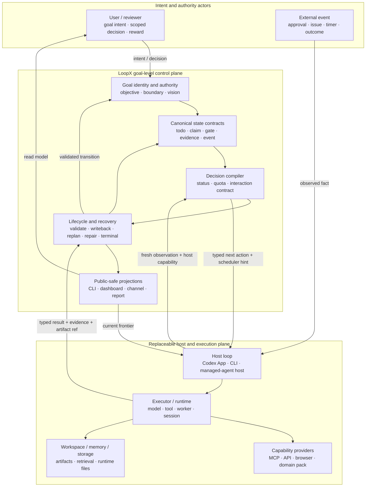
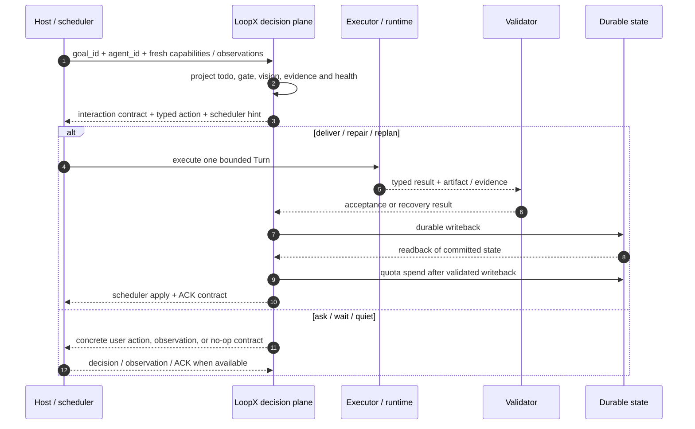
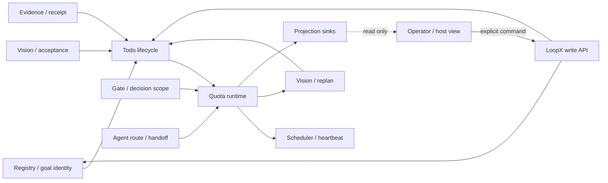
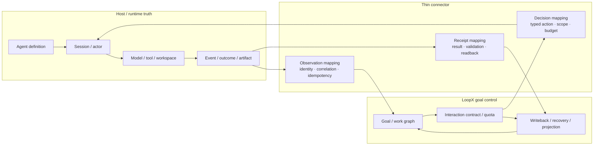

# 第 0 讲：LoopX Goal Control Plane Architecture

> 目标：建立 LoopX 的 authority、运行闭环、持久状态、host integration 与代码边界。

建议时长：90 分钟。架构判断 25 分钟、四视图领读 35 分钟、核心代码 20 分钟、评审练习 10 分钟。

## Architecture Contract

LoopX 定义长程 agent 的 **goal-level control plane**。执行 runtime、memory provider、
workspace storage 和展示 sink 可以替换或协作；goal identity、lifecycle、canonical state
contract、验证与恢复闭环由 LoopX 组织。

“组织”不表示 LoopX 执行所有动作。LoopX 规定一个动作何时构成合法、可恢复、可继续的
goal transition；host 与 runtime 负责应用实际 effect。

架构由五个相互对齐的视图描述：

| 视图 | 回答的问题 | 排除的内容 |
| --- | --- | --- |
| Goal-level authority map | LoopX、user、host、runtime 与 provider 分别拥有什么？ | Python 目录和部署节点 |
| Lifecycle control loop | 一轮工作何时成为 committed transition？ | 每个状态字段 |
| Durable state / state-machine view | 长期事实怎样跨 session 恢复？ | host 内部调用栈 |
| Host integration view | 怎样接入 Codex 或 managed-agent runtime？ | 第二套 control plane |
| Bounded-context code map | 一条规则应落在哪个模块？ | 产品边界的全部解释 |

第一张图是 canonical overview；其余视图只放大一类关系。五个视图共享相同的
`goal_id`、authority、typed decision、receipt 与 recovery 语义。

## 第一张图：Goal Control Plane Authority Map

该图是 LoopX 的 canonical architecture overview，按**事实、决策、执行和回执的权力
边界**组织，不表示源码层次或部署拓扑。



读图时先看四条边界：

1. **Host 负责唤醒和承载执行，不拥有 goal truth。** 它可以创建 session、调用模型、
   应用 RRULE 或恢复 worker，但不能因为“一轮结束了”就自行宣布 goal 完成。
2. **Executor 负责 bounded action，不拥有长期 lifecycle。** 模型可以实现、检查、
   调研和提出 replan；结果必须经过 typed result、验证和 durable writeback。
3. **Memory 与 workspace 保存内容，不拥有状态含义。** 存储实现可以替换，
   `todo=done`、gate 已批准或 terminal 已满足等语义仍由 canonical contract 决定。
4. **Projection 负责让人和 host 看见，不反向成为事实源。** Dashboard、频道和报告可以
   发起经过授权的写请求，但不能靠改展示文本改变状态。

### Authority 不是“谁有这份数据”

同一个事实可能经过多层，但只有一个 canonical owner：

| 对象 | Canonical owner | 其他层可以做什么 | 不能做什么 |
| --- | --- | --- | --- |
| Goal identity / boundary / vision | LoopX goal contract | host 携带 `goal_id`，user 修改方向 | session 用聊天摘要替换 goal |
| Todo lifecycle / gate scope | LoopX state contract | agent 提交 mutation，user 作 scoped decision | projection 或 runtime 私自关闭 gate |
| Session / model / tool execution | Host / runtime | LoopX 选择 bounded action、要求 receipt | LoopX 假装自己完成模型与工具调用 |
| Artifact bytes / workspace files | Workspace owner | LoopX 保存引用、hash、validation evidence | 仅凭文件存在宣布 acceptance 通过 |
| Memory retrieval / provider state | Memory provider | LoopX 声明 required read、保存引用 | provider recall 自动改写 goal truth |
| Scheduler mechanism | Host scheduler | LoopX 给 cadence proposal、校验 ACK | prompt 复制一套长期调度政策 |
| Quota / next-action decision | LoopX decision contract | host 执行决定或返回 failure | host 用“已唤醒”冒充已获 delivery 权限 |
| Dashboard / channel / report | Projection sink | 展示、过滤、提交显式命令 | 展示行成为 canonical state |

`claimed_by`、lease、workspace write scope 和 lifecycle authority 必须分开。它们分别
回答“默认路由给谁”“谁正在占用执行资源”“哪里能写”和“谁能改变工作项状态”，不能
压成一个 `owner=true`。

## 第二张图：一次 Goal Transition 怎样闭环

总览图说明谁负责什么，运行图说明一轮什么时候才算完成。



关键不变量：

- `quota should-run` 是决策编译器，不是模型 scheduler。它把 source facts 压成
  agent、user、CLI 和 host 都能执行的协议。
- `should_run=true` 只表示当前存在可尝试的 bounded transition，不等于拥有生产权限、
  workspace 写权限或 user decision。
- spend 晚于 validation 和 durable writeback。失败、等待、只读观察和未结算 scheduler
  proposal 不能伪装成 material progress。

## 第三张图：不是一个巨型状态机

LoopX 的 durable state 由多个 canonical body 组成，runtime state 则是共享事实上的派生
投影。它不是一个包含所有业务状态的巨型枚举。



这些 cooperating machines 共享 `goal_id`、`agent_id`、todo identity、event lineage 和
receipt，而不是互相复制状态。比如：

- todo 的 `Running` 来自 quota 与 run history，不需要再持久化一份 running truth；
- gate 是否阻塞取决于 decision scope 是否覆盖当前 action，不是看到 open gate 就全局停机；
- monitor 的 no-change streak 属于 agent 与 monitor target，不能被另一条 monitor 轮询清零；
- vision/replan 在需要时先于 monitor quiet 和 no-candidate wait，避免长期目标只剩观察项后静默停滞；
- scheduler ACK 结算具体 proposal identity，不是只比较当前 RRULE 看起来相等。

详细状态体和 legal transition 分别由
[State Definitions](../../product/core-control-plane/state-definitions.md) 与
[State Machines](../../product/core-control-plane/state-machine.md) 维护；上图只表示它们
在总架构里的关系。

## 第四张图：Host 接入，而不是第二个 Runtime

Codex App、Codex CLI 或 managed-agent 平台可能同时拥有 session、actor、tool、
workspace、事件和 scheduler。接入 LoopX 时，它们不需要放弃 runtime ownership；双方只需
在窄协议面交换 observation、decision、result 和 receipt。



以 managed-agent 平台为例，它可以同时扮演 host loop 和 execution runtime：

- 平台继续拥有 Agent Definition、Session、Actor、Environment、Workspace、模型工具调用、
  runtime event、placement、cancel、retry 和 runtime recovery；
- LoopX 维护跨 session 的 goal、work frontier、gate、quota、evidence、successor、handoff
  与 goal-level recovery；
- connector 负责 identity、correlation、幂等、typed event 和 receipt readback；
- 如果平台自己的 coordinator 已拥有某个 Task DAG 的 lifecycle，LoopX 默认做 projection
  与 guard。只有显式选择 LoopX 为该工作项 controller 并授予 scoped authority 后，LoopX
  才写对应 lifecycle。

Runtime 执行一次请求；goal control plane 决定这次结果如何进入长期目标，以及下一轮
可以安全做什么。两者通过窄协议协作，不互相替代。

### 三条 loop 可以协作，但不能混成一个 owner

复杂平台通常同时存在三条闭环：

| Loop | 主要问题 | 典型 owner | 与 LoopX 的关系 |
| --- | --- | --- | --- |
| Execution loop | 一次请求在哪里、怎样运行和恢复？ | Session / worker runtime | LoopX 提供 bounded action，接收 result |
| Coordination loop | 多个 agent 分享什么、怎样 delegation / handoff？ | Task controller + goal control | 以显式 controller 和 scoped authority 对齐 |
| Evolution loop | 经验怎样成为 agent definition 变更？ | Proposal / eval / publish pipeline | LoopX 保存目标、gate 和验证 lineage，不直接发布 |

把三条 loop 画在同一张图上是有价值的，但必须标出每条 loop 的 state owner、recovery
owner 和 evidence surface。否则“能观察 session”很容易被误读成“能控制 goal”，
“能生成 proposal”也容易被误读成“可以改线上 agent”。

## 核心代码领读：架构边界如何进入真实事务

### 1. 决策先保持只读

`loopx/control_plane/turn_driver/driver.py` 中的 `build_loopx_turn_plan` 把
`TurnEnvelope` 投影成 typed host decision，并明确保留只读边界。下面省略了与边界无关
的返回字段：

```python
return {
    "mode": "plan",
    # ...
    "route": {
        "kind": route.value,
        "would_invoke_host": would_invoke_host,
        "host_invocation_allowed": False,
    },
    "effects": {
        "host_invoked": False,
        "state_written": False,
        "scheduler_acknowledged": False,
        "quota_spent": False,
    },
    "boundary": {
        "read_only": True,
        "requires_explicit_execute_surface": True,
    },
}
```

因此，“决策认为可以调用 host”和“已经执行外部 effect”是两个状态。preview、proposal
和 projection 不能冒充执行。

### 2. 一个 Turn 是可恢复事务

`loopx/control_plane/turn_driver/transaction.py` 将事务阶段固定为：

```python
TRANSACTION_PHASES = (
    "host_execute",
    "typed_result",
    "validation",
    "durable_writeback",
    "quota_spend",
    "scheduler_apply",
    "scheduler_ack",
)
```

`run_loopx_turn_once` 在
`loopx/control_plane/turn_driver/executor.py` 中逐阶段写 journal。host result 先通过
schema validation 和 task postcondition，随后才调用 `writeback`；只有 writeback 返回
`appended=true` 才允许 `spend`。scheduler 未完成时，journal 留在
`scheduler_action_required`，而不是错误地标成 committed。

这段代码把总览图中的 authority 边界变成了可测试不变量：

```text
decision != effect
result != accepted result
accepted result != durable transition
durable transition precedes spend
scheduler apply != scheduler ACK
```

### 3. Quota 编译多个 channel

`loopx/quota.py` 的 `build_quota_should_run` 先读取 goal、agent、todo、gate、capability、
monitor、vision 和 health，再在返回前构造：

```python
payload["interaction_contract"] = build_interaction_contract(...)
payload["scheduler_hint"] = _scheduler_hint(...)
payload["protocol_action_packet"] = build_protocol_action_packet(payload)
```

所以 quota 不是架构图上的一个“限流框”。它是 source facts 到 typed next action 的决策
边界；scheduler 只是消费决策的一种 host mechanism。

## 代码地图：最后才看目录

建立 authority 心智模型后，再用 bounded context 定位实现：

| Change reason | Canonical code area | 代表入口 |
| --- | --- | --- |
| Goal identity、vision、replan | `loopx/control_plane/goals/` | `build_goal_frontier_projection` |
| Todo、gate、claim、mutation authority | `loopx/control_plane/todos/` | `contract.py`、`decision_scope.py` |
| Work-lane 与 interaction projection | `loopx/control_plane/work_items/` | `build_interaction_contract` |
| Quota 编译与 spend accounting | `loopx/control_plane/quota/` + quota facade | `build_quota_should_run` |
| Host cadence、monitor 与 ACK | `loopx/control_plane/scheduler/` | `build_scheduler_hint` |
| Typed Turn 与 transaction | `loopx/control_plane/turn_driver/` | `build_loopx_turn_plan`、`run_loopx_turn_once` |
| Event、history、runtime projection | `loopx/control_plane/runtime/` | `event_ledger.py`、`run_history.py` |
| Cross-runtime delivery / handoff | `loopx/control_plane/handoff/` | `delivery_contract.py` |

兼容 facade 可以保留公共 import，但新规则应落在真正拥有 change reason 的 bounded
context。目录相似不等于共享语义；只有重复的 contract、transition 或 lifecycle invariant
才值得收敛。

## 评审一张架构图或一个接入方案

面对一个新 host、memory provider、MCP、dashboard 或 multi-agent proposal，依次问：

1. **Source**：输入事实来自哪里？是 canonical state、host observation，还是仅存在于聊天？
2. **Authority**：谁有权改变它？scope 是 goal、agent、todo、action 还是一次 Turn？
3. **Execution**：谁真正应用外部 effect？LoopX 是否错误地承担了 runtime responsibility？
4. **Receipt**：结果怎样与 proposal、todo version、agent 和 artifact 建立 lineage？
5. **Recovery**：中断、失败、无变化或 session 替换后，从哪份 durable state 恢复？
6. **Projection**：人和 host 看见的是否是可重建 read model？写入是否回到显式 API？

缺少前五项的图只是组件清单。把 source、authority、execution 和 receipt 全部交给同一
个“Agent”方框，也没有形成可实现的控制面边界。

## 课程导航

| 后续讲次 | 对应架构视图 |
| --- | --- |
| 第 1 讲 | 从 authority map 进入第一次真实 Loop |
| 第 2 讲 | 放大 durable state 与 projection |
| 第 3 讲 | 放大 todo、claim、authority 和 handoff |
| 第 4 讲 | 放大 quota 与 interaction contract |
| 第 5 讲 | 放大 host、heartbeat、scheduler apply / ACK |
| 第 6 讲 | 放大 evidence、writeback、replan 和 repair |
| 第 7、8 讲 | 把架构不变量变成工程与质量门禁 |
| 第 9 讲 | 把 capability、extension、domain state 和 multi-agent 接回同一 kernel |

## 课后检查

1. 为什么 LoopX 的正式总览图应优先展示 authority，而不是七层源码目录？
2. 为什么 memory provider 可替换，不代表 goal memory 的 contract owner 也可以隐式替换？
3. 当一个平台同时拥有 scheduler、session 和 Task DAG 时，LoopX 怎样避免成为第二个 controller？
4. `host_execute` 成功后，还缺哪些阶段才算一次 committed Turn？
5. 为什么 state machine、sequence diagram 和 deployment view 不能互相替代？

下一讲从这套图谱进入一次真实操作：用户只表达目标后，guided start、todo、heartbeat、
quota、writeback 和 spend 如何串成第一条可运行闭环。
