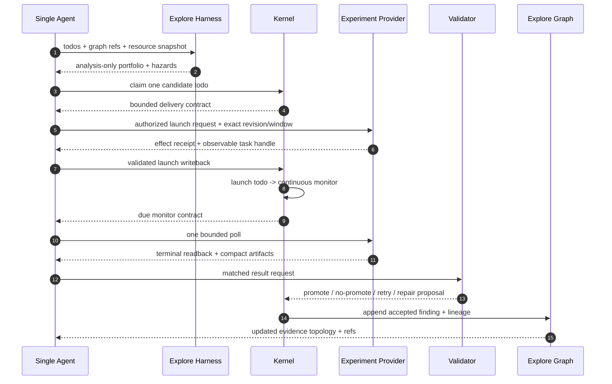

# 第 9 讲：扩展层、Explore 与 Multi-Agent 产品

> **本讲结论：** Extension 交付可选 provider、domain facts、capability 或 presentation；
> 它复用同一份 goal、todo、quota、scheduler、evidence 与 handoff contract，不创建第二个
> kernel。

建议时长：130 分钟。扩展地图 30 分钟、Explore 30 分钟、Single-Agent Auto ML 25 分钟、
Multi-agent/Auto Research 30 分钟、实验 15 分钟。

## 学习目标

完成本讲后，开发者应该能够：

1. 使用 `configure-goal` 预览和开启 default-off feature。
2. 准确区分 Explore Graph 和 Explore Harness。
3. 解释 Harness 为什么只是 analysis-only planner，而不是执行授权。
4. 解释 user、preset、kernel 三层 multi-agent minimality。
5. 判断 supervisor、multi-subagent、reward memory、connector 各自扩展哪个边界。
6. 区分 Provider 的运行责任与 Extension 的交付生命周期。
7. 用 Single-Agent Auto ML 解释 Explore Graph、Harness、Domain Pack 与 Kernel 怎样组合。

本讲采用分层阅读：所有开发者先读 Extension Contract、分层原则和 Feature Catalog；
做探索产品再读 Graph/Harness 与 Single-Agent Auto ML；做 multi-agent 产品再读 Generic
Kernel 与 Auto Research；只有接入对应 surface 时，才需要继续读 Supervisor、Reward
Memory 或 Lark Event Inbox。

## 从 Auto Research 反推 Extension Contract

第 0 讲把 Auto Research 当作产品 Showcase；本讲把它拆成一个可复用 extension：

| Surface | Auto Research 提供 | 继续由通用层拥有 |
| --- | --- | --- |
| User entry | open question、少量 preset 选项 | goal identity、preview/execute boundary |
| Provider | evaluator、artifact source 与可选 sink 的 observation/readback | transition 与 goal lifecycle |
| Capability Pack | role defaults、evidence adapter、decision candidates | todo/gate/quota/handoff/terminal semantics |
| Domain State | hypothesis、experiment、dev/holdout evidence | claim、permission、scheduler、spend |
| Host integration | visible worker panes、isolated executor turn | session lifecycle、workspace guard、effect receipt |
| Projection | evidence graph、research frontier、showcase | canonical state 与 transition authority |

如果一个新 extension 能按这五行回答，通常不需要复制 runner。若它必须自己维护 agent
身份、runnable queue、retry、gate、completion 和 cadence，它已经不是薄 capability，而是
第二个 control plane。

## 扩展层的总原则

LoopX 扩展不应创建第二套：

- goal truth；
- todo lifecycle；
- quota decision；
- scheduler；
- peer identity；
- evidence ledger；
- user gate；
- spend accounting。

一个扩展应该提供：

```text
provider implementation / domain evidence / role defaults / presentation sink
```

然后复用：

```text
registry -> status -> quota -> interaction contract -> todo/evidence -> refresh/spend
```

## 运行责任与扩展交付

Extension 是安装、启停、升级和分发边界，不是运行时的第五个 owner。运行时仍按四种责任
分工：

| 角色 | Owns | Must not own |
| --- | --- | --- |
| Agent | 通过 host/runtime 完成方案、分析、工具与一次有界执行 | durable lifecycle 或未授权 effect |
| Provider | 外部调用、observation、effect result 与 readback | transition policy 或 todo state |
| Capability Pack | 领域 route、归一化、validator、typed transition 与 preset | 绕过 Kernel 的 permission 或 lifecycle |
| Kernel | vision、goal、todo、gate、monitor、quota、writeback、scheduler、evidence、handoff | Issue-Fix/Explore/ML 的专用判断 |

Domain State 保存 feasibility、PR lifecycle、experiment result、checkpoint 等紧凑连续性，
但它是 Capability 与 Kernel 使用的工件，不是另一个 actor。Extension 可以交付 Provider，
也可以只携带自己的 command 或 presentation；只有调用者需要稳定、provider-neutral 的结果
合同时，才新增公共 Capability。

这套分工让领域能力增加专属事实，同时复用 Kernel 的权限和生命周期模型。
当前 Issue-Fix pack 直接复用通用 Domain State seam：

```python
from ..domain_state import default_domain_state_file_path, upsert_domain_state_jsonl

def _upsert_issue_fix_payload(ledger_path, payload, *, key, ...):
    projection = payload.get("domain_state_projection")
    if not isinstance(projection, dict):
        raise ValueError("issue-fix payload must include domain_state_projection")

    projection["write_performed"] = True
    try:
        result = upsert_domain_state_jsonl(
            ledger_path,
            payload,
            key=key,
            existing_key_fn=existing_key_fn,
            unchanged_fn=unchanged_fn,
            merge_existing_fn=merge_existing_fn,
        )
    except Exception:
        projection["write_performed"] = False
        raise
    projection["write_result"] = result
    return result
```

ML Experiment 走相同 seam，只替换自己的稳定 key 和 payload validator：

```python
return upsert_domain_state_jsonl(
    ledger_path,
    payload,
    key=ml_experiment_ledger_key(payload),
    existing_key_fn=ml_experiment_ledger_key,
)
```

这两个调用点给出一条可操作的评审规则：如果新 pack 只需要紧凑领域事实，就复用
Domain State；如果它需要改变谁可执行、何时 spend、哪个 gate 生效，就必须回到
Kernel 提出通用规则并接受第 7、8 讲的语义与质量门禁。

同时保留三条数据边界：raw log、凭据和本地路径留在获批的私有 artifact；Domain
State 只保存可重放的 compact facts；外部 sink 只消费 public-safe projection。
`examples/issue-fix-feasibility-smoke.py` 与
`tests/test_ml_experiment_volc_packet.py` 是这条分层的代表性回归入口。

## 先读 Feature Catalog

不要从 README 猜当前可配置能力。对已注册 goal 运行：

```bash
loopx --format json configure-goal --goal-id <goal-id>
```

不带 `--execute` 时是预览。当前 catalog 的重要能力都默认关闭：

| Feature | 解决什么 | 默认不做什么 |
| --- | --- | --- |
| `multi_subagent` | 允许 bounded child-agent use | 不创建 hierarchy，不绕过 claim/quota/gate/scope |
| `explore_graph` | 持久化探索 evidence topology 并可投影 | 不自动开启 harness/spawn |
| `explore_harness` | 对 todo/worker branch 做只读分析规划 | 不 claim、lease、launch、mutate、spend |
| `reward_memory` | 实验性 per-agent reward/experience memory | 不全局安装 provider，不自动 ingest/recall |
| `lark_event_inbox` | 可选飞书事件 inbox 配置 | 不自动授权、发消息或写 goal state |
| `peer supervisor` | 观察多个 peer 并记录 typed proposals | 不成为 leader，不默认执行 host effects |

配置规则：

1. 先 preview；
2. 阅读 exact delta 和 boundary；
3. 再显式 `--execute`；
4. 关闭 feature 时保留历史 evidence，只关闭未来行为；
5. feature gate 不等于 runtime permission。

## Explore Graph：探索证据层

Explore Graph 的 canonical 数据不是一张图，而是 append-only result log：

```text
goals/<goal-id>/explore-result-log.jsonl
```

事件 schema 为 `loopx_explore_result_event_v0`，三种 kind：

| Kind | 作用 | 代表状态 |
| --- | --- | --- |
| `node` | 问题、领域、假设、实验、artifact | open/exploring/blocked/resolved/dead_end |
| `edge` | 节点关系 | subtopic_of/depends_on/answers/supports/refutes/leads_to |
| `finding` | 发现 | tentative/confirmed/refuted |

写入示例：

```bash
loopx explore node \
  --goal-id <goal-id> \
  --node-id hypothesis_cache \
  --title "Cache repeated evidence reads" \
  --status exploring

loopx explore edge \
  --goal-id <goal-id> \
  --from hypothesis_cache \
  --type supports \
  --to reduce_startup_latency

loopx explore finding \
  --goal-id <goal-id> \
  --finding-id cache_hit_result \
  --title "Repeated read latency decreased" \
  --node hypothesis_cache \
  --status confirmed
```

记录时会执行 compact text、credential marker、absolute path 等边界检查。

### Projection

```bash
loopx explore summary --goal-id <goal-id>
loopx explore graph \
  --goal-id <goal-id> \
  --graph-format mermaid \
  --out explore.mmd
```

Projection 包含：

- latest node/edge/finding state；
- status counts；
- blocked reasons；
- current frontier；
- topology tree；
- Mermaid source。

Focused graph 只是 bounded evidence view，不删除 canonical evidence：

```bash
loopx explore graph \
  --goal-id <goal-id> \
  --status exploring \
  --status blocked \
  --tag executive \
  --graph-format mermaid
```

Executive view 是 derived display projection，必须保留 source lineage。不要为了“图小于 20 个节点”删除 material evidence。

### 开启 Graph

```bash
loopx configure-goal \
  --goal-id <goal-id> \
  --explore-graph-enabled \
  --no-explore-harness-enabled
```

确认 preview 后：

```bash
loopx configure-goal \
  --goal-id <goal-id> \
  --explore-graph-enabled \
  --no-explore-harness-enabled \
  --execute
```

Graph on、Harness off 是常见模式：保留探索拓扑，但不改变工作规划。

Material `refresh-state` 会折叠 canonical Explore evidence 并运行已配置 sink。Semantic digest 未变化时应 zero-write。外部 sink 失败/readback 失败会留下 retryable postcondition。

## Explore Harness：只读分支规划器

Harness 提供两个 planner：

```text
todo-branch-plan: 一个 branch 约等于一个候选 todo
worker-branch-plan: 一个 worker lane 可以包含一小组 todo
```

它们分析：

- candidate rank；
- confidence/expected evidence；
- write-scope conflicts；
- required capabilities；
- resource lanes/capacity；
- branch width；
- typed Explore evidence links；
- monitor exclusion；
- suggested claim/lease commands。

它们不做：

- claim todo；
- acquire lease；
- launch agent；
- mutate state；
- spend quota；
- 替代 `quota should-run`。

### 独立 Gate

Harness gate 只认注册 goal 的：

```yaml
spawn_policy:
  spawn_allowed: false
  max_children: 3
  explore_harness:
    enabled: true
    profile: adaptive-resilient
```

不能从第二个 registry key 或本地 prompt 获得隐藏授权。

配置：

```bash
loopx configure-goal \
  --goal-id <goal-id> \
  --explore-harness-enabled \
  --explore-harness-profile adaptive-resilient
```

确认后加 `--execute`。

行为表：

| Harness | Spawn | Planner 输出 |
| --- | --- | --- |
| disabled | 任意 | disabled packet，无 branches |
| enabled | false | analysis-only，suggested commands 为空 |
| enabled | true，max_children>0 | 仍为 dry-run，但可给 suggested claim/lease commands |
| enabled | true，max_children=0 | contradiction，退化为 analysis-only |

即使有 suggested commands，真正执行仍需普通 quota、claim、lease、workspace、gate 和 spend 生命周期。

### Profiles

#### `generic`

基础优先级/置信度和 scope-safe branch planning。

#### `adaptive-resilient`

增加：

- independent-lane admission；
- value-first packing；
- start staggering guidance；
- retry/backoff 和 infra-family cooldown hints；
- A/B metadata。

这些是 planner metadata，generic runtime 不会因为 profile 名称自动执行 retry loop。

#### `moe-router`

把 task family 当 expert、todo 当 token、worker lane 当 serving slot：

- per-family value/acceptance/infra EMA；
- UCB/coverage/bias 用于 routing order；
- confidence 和 novelty 用于 admission，避免 bias 污染价值估计；
- serial todo bundle 使用 confident-prefix；
- load profile 校准并行干扰；
- 有价值下限的 opportunistic expansion。

Router state 由 runner 在 epoch boundary 持久化。Harness 仍然只生成计划。

## Explore Graph 与 Harness 的组合

| Graph | Harness | 场景 |
| --- | --- | --- |
| off | off | 普通 LoopX goal |
| on | off | 记录和展示探索结果，不改变规划 |
| off | on | 临时分析 todo/worker portfolio，不保存 topology |
| on | on | evidence topology + advisory branch planning |

两者独立是重要安全边界：presentation 需要图，不应顺带允许更多 agent；分析 branch，不应自动写图或外部 sink。

## Single-Agent Auto ML：Graph、Harness 与 Domain Pack 怎样合起来

Single-Agent Auto ML 不是缩小版 Auto Research。它只有一个长期 agent lane，却要同时处理：

- 候选实现与代码 revision；
- 训练/评估 provider 的异步 task；
- short/long 等资源容量；
- matched baseline、数据窗口、primary metric 与 guardrail；
- 模型失败、基础设施失败和不可比结果的归因；
- promote、no-promote、retry、repair 与下一批探索。

这类系统的稳定性来自四个彼此独立的合同：

| 合同 | 负责什么 | 在当前公开实现中的位置 |
| --- | --- | --- |
| ML Experiment Domain Pack | metric/window/result/hypothesis/replan 的 typed advisory contract | `loopx/domain_packs/ml_experiment.py` |
| Explore Graph | 持久化 hypothesis、experiment、finding 与 evidence edge | `loopx/capabilities/explore/result_log.py` |
| Explore Harness | 基于 todo、Graph refs、scope、expected evidence 和 resource capacity 规划 portfolio | `loopx/capabilities/explore/worker_branch_plan.py` |
| Kernel | todo、claim、defer/resume、monitor、quota、gate、writeback、spend、scheduler | `loopx/control_plane/` 与 quota/status 入口 |

当前公开 ML Experiment pack 默认是 `suggest_only`，preview 明确返回
`launch_actions_enabled=false` 和 `production_actions_enabled=false`。真实 launch/poll/readback
由获得显式 goal boundary 与 effect authority 的 provider/extension 实现；课程案例不把任何
特定训练平台的 adapter 误写成 Kernel 能力。

### 一条端到端控制链



图中 `K->>G` 表示 material refresh 后追加已接受的 public-safe evidence，不表示 Kernel
把所有私有结果复制到 Graph。原始日志、凭据、内部 URL 和本机路径继续留在 provider
边界；Graph 只保存稳定 alias、结果分类和 typed relation。

### Harness 如何在单 Agent 场景发挥价值

单 Agent 不需要 Harness 启动 child。它最有价值的模式恰好是 `analysis_only`：

```text
candidate todos
  + Graph 中的 supports/refutes/depends_on
  + near-neighbor exclusions
  + required capabilities/write scopes
  + resource capacity and active usage
  -> ranked portfolio + blocked reasons + expected evidence
```

例如两个短实验槽已经占满时，Harness 可以继续比较下一批候选，却不能 claim 或 launch。
Kernel 把候选保留为 `deferred`，用 `resume_when=capacity_available:<lane>` 等待权威容量
readback。一个 external task 进入运行态后，普通 `continuous_monitor` 负责按 cadence
观察；monitor 本身不被误算为新的实验槽或新候选。

Harness 输出的三个层次也要区分：

| 输出 | 含义 | 后续 |
| --- | --- | --- |
| rank / expected evidence | 候选价值的 advisory estimate | Agent 可用于解释选择 |
| hazard / blocked reason | scope、capability、capacity 或 evidence 缺口 | Kernel todo/gate/defer 承接 |
| suggested command | 满足同一 goal boundary 时可显示的下一步命令 | 仍需普通 claim/lease/quota 执行 |

### Graph 如何让负向实验产生长期价值

只记录“当前最好分数”会让 Agent 重复尝试已失败的近邻方案。Explore Graph 应同时保留：

```text
hypothesis --leads_to--> experiment
experiment --supports/refutes--> finding
finding --depends_on--> matched contract
negative finding --rules_out--> near-neighbor family
diagnostic finding --depends_on--> provider/runtime condition
```

Comparable no-promote 是模型证据，可以收缩候选空间；infra failure 是诊断证据，只能形成
repair/retry，不应 `refutes` 模型假设。Harness 下一轮消费这些边界后，才能减少重复试验，
把资源留给真正增加信息量的候选。

### Promotion、Reward Memory 与系统能力演进

Graph finding 和 Harness ranking 都不是 promotion authority。Promotion 至少需要：

```text
exact candidate/revision/window
+ matched baseline
+ primary metric and guardrails
+ independent result attribution
+ applicable owner/release gate
+ activation readback and rollback path
```

Reward Memory 可以在相同 scope 内提示“某类方案过去常因哪个 guardrail 失败”或“评审者偏好
哪种证据表达”，但必须让当前 Graph/source state 胜出。它不能把旧 reward 变成 task
readback，也不能扩大 launch 或 promotion 权限。

若实验暴露的是系统能力缺口，例如需要新 reader、feature operator 或 evaluator，下一步
应创建独立 capability todo，通过代码验证、兼容性检查、版本化离线/在线 artifact、
release gate 与 rollback 后再激活。实验 todo 不能顺手改写并发布运行系统。这是
“算法路线 replan”和“系统能力演进”共享证据、分开 authority 的关键。

### Public-safe 最小实验

先运行默认关闭的 advisory preview：

```bash
loopx ml-experiment preview --format json \
  --experiment-id exp_preview_v1 \
  --primary-metric offline_metric \
  --baseline-value 0.421 \
  --candidate-value 0.437 \
  --guardrail-status clean \
  --train-window train_window_v1 \
  --eval-window eval_window_v1 \
  --hypothesis-id h_route_mix_v1 \
  --mechanism-family "candidate route mix" \
  --route route_mix \
  --positive-evidence offline_eval_delta_positive \
  --next-candidate holdout_eval
```

验证 packet 没有 launch/production authority。再对一个临时 goal preview Graph on 与 Harness
analysis-only，确认 planner boundary 中 `writes_state`、`claims_todos`、`acquires_leases`、
`starts_agents` 和 `changes_quota` 均为 false。这个实验验证组合边界，不需要真实训练任务。

## Generic Multi-Agent Kernel

LoopX 的 multi-agent 产品采用三层 minimality：

| 层 | Owns | Must not own |
| --- | --- | --- |
| User | objective 和少量产品选项 | pane、tick、quota/frontier 细节 |
| Preset | domain roles、handoff hints、metric/evidence adapter、defaults | runner lifecycle、通用 replan、TUI、claim/quota protocol |
| Kernel | runner、真实 Codex TUI panes、workspace-safe launch、pane-local tick、todo/evidence/status、vision/replan | domain-specific research/support/sales 语义 |

一个新产品不应 copy Auto Research runner。它只写自己的薄 preset，然后复用 `loopx/control_plane/agents/multi_agent/`。

Kernel 的关键 invariant：

```text
leader_agent_required = false
broadcaster_selects_todo = false
each_pane_reads_own_quota_frontier = true
todos_and_evidence_are_handoff_authority = true
```

## Auto Research 是 Preset，不是第二内核

用户入口只有一个开放问题：

```bash
loopx auto-research "<open question>"
```

它先输出固定 contract，不启动 pane：

- research brief；
- P0/P1/P2 action plan；
- evidence refs；
- next executable step；
- exact gate。

预览一键启动：

```bash
loopx --format json auto-research start \
  "How should we evaluate autonomous research agents?"
```

执行 visible lanes：

```bash
loopx auto-research start \
  "How should we evaluate autonomous research agents?" \
  --execute
```

默认角色：

| Role | Owns |
| --- | --- |
| research-curator | contract、boundary、metric、stop/gate |
| hypothesis-proposer | todo-backed hypotheses、successor、retirement rationale |
| research-executor | isolated attempts、scored/unscored evidence |
| evaluator-promoter | holdout/verification、claim classification、promotion gate |

Launcher 打开真实 Codex TUI panes，但不选择 todo、不执行 worker turn、不写研究结果。当前默认由每个可见 pane 运行自己的第一次 quota/frontier tick；需要显式 post-launch 广播时才使用 `--wake-visible-after-launch`。无论哪种唤醒方式，broadcaster 都不能替 pane 决定 todo。

### KNN Demo

```bash
loopx --format json auto-research start \
  "How can the KNN solver improve exact-neighbor speedup?" \
  --preset knn-demo \
  --language zh \
  --execute
```

Preset 可以定义 benchmark workspace、editable/protected files、metric 和 role hints，但不能添加产品专属 coordinator。

可见 pane 启动只证明 runner positive path，不证明 lane 已产生研究成果。研究 evidence 必须由实际 role 工作后写入。

## Multi-Subagent

`multi_subagent` 允许某个 executor 在 bounded todo 内调用 child agents，适合并行只读调查或隔离子问题。

它不应：

- 注册永久 hierarchy；
- 让 child 继承 parent 的全部 authority；
- 绕过 todo claim；
- 共享一个可写 worktree；
- 替 parent 伪造 aggregate evidence。

Parent 仍负责把 child result 压缩为 public-safe evidence，并完成当前 todo 的 validation/writeback。

## Peer Supervisor

开启方式：

```bash
loopx configure-goal \
  --goal-id <goal-id> \
  --supervisor-agent <registered-peer> \
  --supervised-agent <peer-a> \
  --supervised-agent <peer-b>
```

先 preview，再 `--execute`。Supervisor 提供 synthesis channel 和 typed proposals，不替代 decentralized todo/quota lifecycle。

适合：

- 比较多个 peer 的 evidence freshness；
- 发现 scope overlap 或失败分支；
- 提议 inject/handoff/discard；
- 给用户一个首选综合对话入口。

不适合：

- 成为永久 leader；
- 自己 launch/fork session；
- 直接完成其他 peer 的 todo；
- 把自然语言判断当 executed effect。

## Reward Memory

Reward memory 是 per-agent、default-off 的实验能力，目标是让经过验证的人类评价和工程经验
在后续 run 中被作用域化复用。它不是 LoopX canonical state 的替代品，也不是把聊天记录长期
注入模型。

| Memory class | 与 LoopX 当前状态的关系 | 允许产生的影响 |
| --- | --- | --- |
| `working_context` | 复用 registry、todo/quota、checkout 等 fresh context | 只服务当前执行或 session continuation |
| `run_bound_reward` | 绑定 exact goal/run 的评价 overlay | 作为候选证据，不直接改变 action set |
| `soft_preference` | 经 review 的 project/surface 偏好 | advisory ranking 或 rewrite |
| `procedural_experience` | 带 revision、provenance 和适用范围的经验 | 经当前 artifact 验证后影响诊断或验证计划 |
| `hard_policy` | 策略内容与独立验证的 authority scope 绑定 | 仅在已有 authority 范围内约束或否决 |

这里最重要的分离是：memory 可以影响模型怎样选择合法动作，不能决定哪些动作原本合法。
Gate/authority 先给出 action set，fresh state 给出当前事实，Reward Memory 再在匹配 scope 内
提供偏好或经验。Application receipt 记录哪条记忆被怎样使用，但不能冒充 delivery receipt。

安全边界：

- config pointer 放 ignored local state；
- 不自动安装全局 provider/dependency；
- 不自动 ingest 所有 transcript；
- 不自动把记忆注入 executor；
- 经验记录不能覆盖当前 todo/gate/evidence truth。

它可以帮助选择策略，但不能成为 authority source。

## Lark Event Inbox 与 Presentation Sink

Lark event inbox 是外部输入 connector 配置；Explore Lark Base 是展示 sink。两者不能混淆。

```text
connector: 外部事件、权限、source authority
projection sink: 把 public-safe LoopX read model 显示到 Lark
```

开启 inbox 不等于允许发送消息或自动写 goal。外部消息必须先经过身份、reply/mention relation、source authority 和 gate 检查，再转换为 bounded LoopX event/todo。

Sink 应保留 lineage：

```text
source_id
row_lifecycle
supersedes
superseded_by
record_id map
readback digest
```

## 实验：只读比较 Graph 与 Harness

### 1. 查看配置 catalog

```bash
loopx --format json configure-goal --goal-id <lab-goal>
```

### 2. Preview Graph on / Harness off

```bash
loopx --format json configure-goal \
  --goal-id <lab-goal> \
  --explore-graph-enabled \
  --no-explore-harness-enabled
```

### 3. Preview Harness analysis-only

```bash
loopx --format json configure-goal \
  --goal-id <lab-goal> \
  --explore-harness-enabled \
  --explore-harness-profile adaptive-resilient
```

不要加 `--execute`。比较两个 delta 的 source field 和 promised behavior。

### 4. 运行 disabled planner

```bash
loopx --format json explore worker-branch-plan \
  --goal-id <lab-goal> \
  --worker-width 3
```

验证 disabled packet 是否说明 `required_contract`，且没有 claim/lease/launch side effect。

## 核心代码领读：Explore、Auto ML 与 Auto Research 怎样复用 kernel

扩展层最重要的判断不是“功能多不多”，而是它有没有重新发明 todo、quota、lease、scheduler 或 evidence。下面沿真实配置与执行边界读。

### 1. Feature config 默认关闭，preview 与 execute 分离

`loopx/configure_goal.py` 把 Explore Harness 放在 goal 的 `spawn_policy` 内：

```python
spawn_policy = goal.get("spawn_policy") or {}
if explore_harness_enabled is not None:
    explore_harness["enabled"] = explore_harness_enabled
if clear_explore_harness_profile:
    explore_harness.pop("profile", None)
elif explore_harness_profile is not None:
    explore_harness["profile"] = explore_harness_profile

if explore_harness:
    spawn_policy["explore_harness"] = explore_harness
else:
    spawn_policy.pop("explore_harness", None)
goal["spawn_policy"] = spawn_policy
```

返回 packet 同时保留 `before`、`after`、`changed_fields`、`written` 和 configuration catalog：

```python
return {
    "dry_run": dry_run,
    "changed": bool(changed_fields),
    "before": before,
    "after": after,
    "written": bool(execute and changed_fields),
    "feature_summary": {
        "explore_graph": ... or {"enabled": False},
        "explore_harness": ... or {"enabled": False},
        "peer_supervisor": ... or {"enabled": False},
        "default": "off",
    },
}
```

因此开启功能的正确节奏是：先运行不带 `--execute` 的 preview，确认 delta 与 boundary，再显式 execute。

### 2. Harness gate 有三态，不是一个 enabled 布尔值

`loopx/capabilities/explore/harness_gate.py` 把 goal boundary 折叠成 planner gate：

```python
enabled = bool(harness_policy.get("enabled"))
spawn_allowed = bool(compact.get("spawn_allowed"))
max_children = max(0, int(compact.get("max_children") or 0))

if not enabled:
    return {
        "state": "disabled",
        "reason": "explore_harness_opt_in_required",
        "effective_width": 0,
    }

width_caps = [
    (requested, "requested"),
    (max(1, int(max_lanes)), str(max_lanes_label)),
]
if max_children > 0:
    width_caps.append((max_children, "max_children"))
cap_priority = {"max_children": 0, str(max_lanes_label): 1, "requested": 2}
effective_width, width_cap_source = min(
    width_caps,
    key=lambda cap: (cap[0], cap_priority[cap[1]]),
)
if not spawn_allowed:
    state, reason = "analysis_only", "spawn_not_allowed_by_goal_boundary"
elif max_children <= 0:
    state, reason = "analysis_only", "spawn_allowed_without_child_capacity"
else:
    state, reason = "commands_suggested", "goal_boundary_opt_in"
```

三态语义：

- `disabled`：连 lane planning 都不产生，只返回 required contract；
- `analysis_only`：可以排序、估计、比较，但不输出 claim/lease 命令；
- `commands_suggested`：可以建议命令，仍不执行命令。

### 3. Worker branch planner 永远是 read-only planner

`build_explore_worker_branch_plan` 的 docstring 和 disabled packet 都在强调同一件事：

```python
gate = resolve_explore_harness_gate(
    orchestration,
    requested_width=requested_width,
)
if gate["state"] == "disabled":
    return {
        "enabled": False,
        "selected_worker_branches": [],
        "boundary": {
            "writes_state": False,
            "claims_todos": False,
            "acquires_leases": False,
            "starts_agents": False,
            "changes_quota": False,
        },
        "required_contract": explore_harness_required_contract(...),
    }

branch_candidates, blocked_todos = _build_worker_branch_candidates(...)
if gate["state"] == "analysis_only":
    for branch in branch_candidates:
        branch["suggested_commands"] = []
        branch["commands_suppressed_reason"] = gate["reason"]
```

Planner 可以消费 router state、load profile、resource capacity，计算 branch bundle；但真正 claim、lease、launch 仍走通用 LoopX lifecycle。这样 Auto Research、issue-fix 或未来产品可以复用 planner，而不各自拥有一套 scheduler。

### 4. Explore Graph 是 evidence graph，不是 execution graph

Explore result log 先 canonical validate，再 append：

```python
def append_explore_result_event(path, event):
    validated = validate_explore_result_event(event)
    log_path = path.expanduser()
    with exclusive_file_lock(log_path):
        with log_path.open("a", encoding="utf-8") as handle:
            handle.write(
                json.dumps(validated, ensure_ascii=False, sort_keys=True) + "\n"
            )
    return {
        "event_id": validated["event_id"],
        "result_id": validated["result_id"],
        "event_kind": validated["event_kind"],
    }
```

批量 append 还会按 `event_id` 去重：同 id 同内容可复用，同 id 不同内容报冲突。Node、Edge、Finding 记录的是探索结果、关系与证据 lineage，不会因为图上出现一条 edge 就自动创建 todo 或启动 worker。

`sync_explore_graph_after_material_refresh` 只在 material refresh 后把 result log 投影为 canonical graph/sink；它仍必须服从 external sink authority 和 readback postcondition。Graph 是观察/决策辅助层，不转移 quota、promotion 或 launch authority。

### 5. ML Experiment Pack 只做领域判断

`loopx/domain_packs/ml_experiment.py` 的 advisory builder 生成 typed result、dataset window、
hypothesis ledger 与 replan preview。默认 packet 同时写明：

```text
pack.enabled = false
pack.autonomy = suggest_only
launch_actions_enabled = false
production_actions_enabled = false
```

这使 Graph/Harness 可以消费 compact candidate evidence，又不会让识别出 ML 项目的普通 goal
静默获得训练或生产 effect。项目 provider 要增加 delivery authority，仍须经过 registry
goal boundary、quota、preflight、effect receipt 与 writeback。

### 6. Auto Research 是薄 preset，不是第二个 kernel

`loopx/capabilities/auto_research/preset.py` 公开地限定了 line-count claim：

```python
def build_auto_research_minimal_a2a_recipe(...):
    user_line = (
        "loopx auto-research start "
        f"{quoted_open_question}{language_flag} --execute"
    )
    return build_minimal_decentralized_a2a_recipe(
        product_id="auto-research",
        user_recipe_lines=[user_line],
        preset_recipe_lines=default_auto_research_agent_specs(),
        claim_boundary=(
            "line count covers user intent and auto-research preset defaults only; "
            "the reusable kernel owns visible process launch, fixed wake prompt, "
            "pane-local quota/frontier tick, todo/evidence/status protocol, "
            "and public artifact routing"
        ),
    )
```

每个 role 只声明 domain-specific profile：

```python
return {
    "agent_id": lane["agent_id"],
    "lane_id": lane["lane_id"],
    "role_id": role_id,
    "scope": lane["scope"],
    "role_profile": role_profile,
    "skill": {"name": "loopx-auto-research-worker", ...},
    "handoff_hints": role_profile.get("handoff") or [],
    "reasoning_effort": reasoning_effort,
}
```

Preset 拥有 research roles、handoff hints、metric hints 和 domain defaults；共享 multi-agent kernel 拥有 process launch、fixed wake prompt、pane-local quota tick、todo/evidence/status 与 artifact routing。

### 7. 两个 Explore 功能怎样开启

Explore Graph 与 Explore Harness 可独立开启。推荐先 preview：

```bash
loopx configure-goal \
  --goal-id <goal-id> \
  --explore-graph-enabled \
  --explore-harness-enabled \
  --explore-harness-profile adaptive-resilient
```

确认 `after`、`changed_fields`、`feature_summary` 后再追加 `--execute`。若希望 Harness 输出可执行建议，还必须让同一个 `spawn_policy` 满足：

```text
spawn_allowed=true
max_children>0
explore_harness.enabled=true
```

否则它仍会停在 `analysis_only`。开启 Graph 不会自动开启 Harness，开启 Harness 也不会自动授权 external sink 或 worker launch。

### 8. 一条 extension 的最小审查路径

```text
configure preview
  -> goal_boundary.orchestration projection
  -> feature gate
  -> read-only planner
  -> normal claim/lease/quota lifecycle
  -> compact result event
  -> graph/status projection
  -> optional authorized sink + readback
```

如果一个扩展绕过中间任一步，尤其是直接从 private source 启 worker、直接由 graph edge 改 todo、或由 planner 自己 claim，说明它已经开始复制 control plane。

### 断点与检查问题

- `configure_goal.py:783`：preview 与 execute 的 before/after；
- `resolve_explore_harness_gate:83`：disabled/analysis/commands 三态；
- `build_explore_worker_branch_plan:871`：gate 如何限制 width 与 commands；
- `append_explore_result_events:517`：幂等与冲突；
- `build_ml_experiment_advisory_packet:655`：default-off advisory 与 effect authority 的边界；
- `build_auto_research_preset_role:99`：preset domain 与 kernel mechanics 的边界。

读完应能回答：Graph 和 Harness 为什么独立、analysis-only 如何帮助单 Agent 管理昂贵
实验、ML pack 为什么不带 launch authority、Auto Research 的“四行配置”没有计算哪些
kernel 代码、supervisor 为什么不能借扩展层获得 durable leader authority。

## 代码阅读路线

1. `loopx/configure_goal.py` 和配置 catalog
2. `docs/capabilities/explore/README.md`
3. `loopx/capabilities/explore/`
4. `docs/product/domain-capability-packs.md`
5. `loopx/domain_packs/ml_experiment.py`
6. `docs/reference/protocols/multi-agent-three-layer-minimality-v0.md`
7. `loopx/control_plane/agents/multi_agent/`
8. `docs/guides/auto-research-command-path.md`
9. `loopx/capabilities/auto_research/preset.py`
10. `docs/reference/protocols/peer-supervisor-v0.md`

## 代表性 Smoke

- `examples/project/configure-goal-smoke.py`
- `examples/explore-configure-goal-smoke.py`
- `examples/explore-worker-plan-gate-smoke.py`
- `examples/ml-experiment-domain-pack-smoke.py`
- `examples/auto-research-layered-e2e-acceptance-smoke.py`
- `examples/control_plane/peer-supervisor-smoke.py`
- `examples/showcase-catalog-smoke.py`

## 最终设计检查表

为一个新的 LoopX product preset 或 extension 回答：

1. 用户只需要提供哪些意图？
2. Preset 只拥有哪部分 domain semantics？
3. 哪些 mechanics 必须留在 generic kernel？
4. Feature 是否 default-off？
5. Preview 和 execute 是否分离？
6. Gate 是否只有一个 canonical source？
7. Planner 是否被误写成 executor？
8. External effect 是否有 capability + authority + receipt？
9. Evidence 是否 compact、可追溯、符合 public/private boundary？
10. Focused smoke 是否证明 shipped behavior，而不是临时字段？

## 课程结束后的能力标准

完成第 0 到第 9 讲后，一个新开发者不需要记住所有 CLI 参数，但应该能够独立完成三件事：

1. 从 `$loopx <task>` 追到 registry、todo、quota、interaction contract、scheduler、refresh 和 spend；
2. 遇到卡住或矛盾状态时，判断是执行失败、projection gap、host drift 还是缺少用户 authority；
3. 为一个扩展写出 source、projection、decision、effect、receipt、validation 的完整边界，并知道什么时候不该实现。
