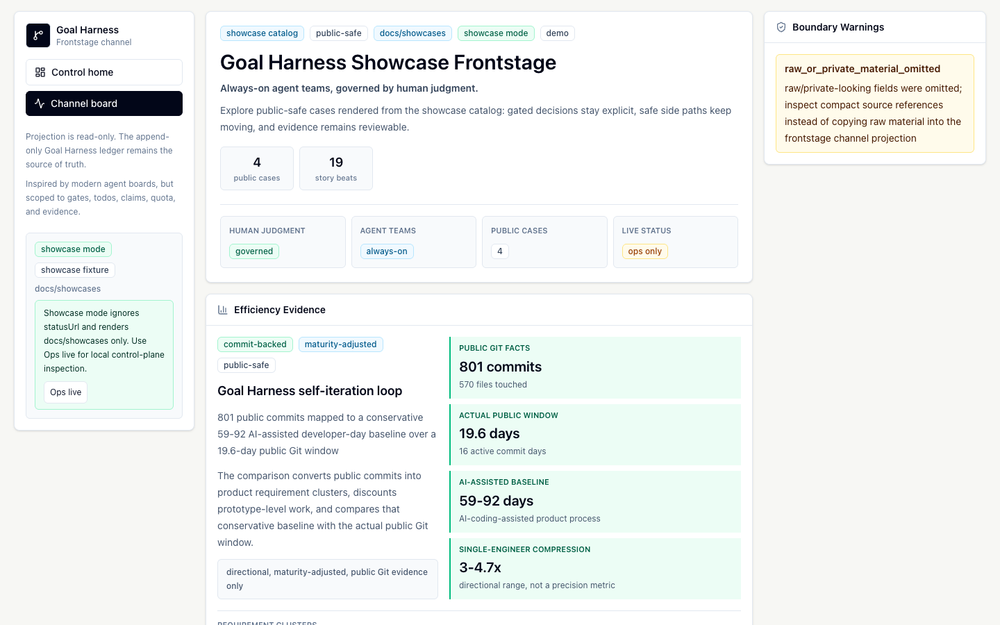

# Frontstage Demo Script

This is a public-safe script for showing LoopX to a new user or
developer in one screen. It uses the hosted frontstage and the showcase catalog,
not local LoopX status exports.

Demo URL:

<https://huangruiteng.github.io/loopx/frontstage/>

## 30-Second Version

LoopX is a control plane for long-running agent work. It does not
replace Codex, Claude Code, Cursor, or another executor loop. It keeps the
long-running goal visible: human gates, agent todos, claims, scope, quota,
evidence, run history, and public/private boundaries.

The frontstage shows the public version of that idea: case cards, narrative
motion, efficiency evidence, and boundary warnings rendered from
`docs/showcases/`.

## 60-Second Walkthrough

1. Open the hosted frontstage.
2. Point at the headline: "Always-on agent teams, governed by human judgment."
3. Point at the case counters: LoopX is explained through public cases,
   not raw private runs.
4. Point at Efficiency Evidence: the self-iteration case maps public Git
   history into a conservative, maturity-adjusted workload story.
5. Point at Public Boundary: the public view is useful because it says what was
   omitted, not because it hides the fact that a boundary exists.
6. Close with the product distinction: executor loops do the work; LoopX
   preserves the control-plane state that lets the next loop continue safely.

## Two-Minute Version

Use this when the audience already uses terminal agents or scheduled agent
loops.

1. Start with the problem:
   "Long-running agent work usually fails when state drifts. A single blocked
   user decision can freeze the whole loop, while safe side work that could
   continue is no longer clearly labeled."
2. Show the frontstage hero:
   "This public view is case-first. It is intentionally not a live registry
   dump."
3. Show the efficiency panel:
   "The self-iteration case is not a vague productivity claim. It maps public
   commits into product-requirement clusters and uses a conservative,
   AI-assisted baseline range."
4. Show the boundary panel:
   "The product value includes knowing what must stay private: raw sessions,
   internal sources, local paths, credentials, and benchmark traces are not
   part of the public showcase."
5. Show the navigation:
   "The hosted frontstage is for public storytelling. Local ops mode exists for
   private control-plane inspection, but it is not a public link."

## What To Say

- "Your agents keep the night shift. You keep the judgment."
- "LoopX is not another model runtime. It is the state layer around
  agent runtimes."
- "The gated route waits clearly; independent safe work can continue with
  evidence."
- "The public demo is showcase-first. It uses public-safe cases rather than
  live local status."

## What Not To Show Publicly

- local `statusUrl` links;
- `mode=ops` URLs;
- local registry or run-history paths;
- raw benchmark logs, trajectories, task text, verifier output, or task ids;
- internal documents, internal screenshots, private project names, or
  credentials.

## Operator Checklist

Before sharing a link or screenshot:

- Use the hosted frontstage URL above or a freshly exported share bundle.
- Confirm the first screen says `showcase mode`.
- Confirm visible case content comes from `docs/showcases/`.
- Confirm no private project names, local paths, internal links, raw logs, or
  live status feeds are visible.
- Keep any ops-mode inspection local to a trusted operator session.
