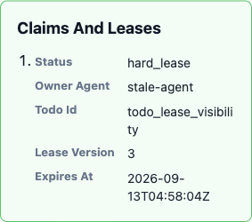
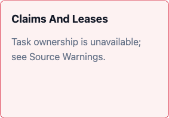

# Goal Channel coordination observation

Goal Channel's `active_leases` is a read-only display of Todo claims and
time-active lease records. A displayed lease is not an execution grant: actual
mutation still checks the owning operation's eligibility, mode and lease fence.

```bash
loopx status --goal-id example-goal --format json
```

Inspect `goal_channel_projection.active_leases` and its `source_warnings` in the
status/attention item. No new capability activation or provider selection is
required. Existing Goal Channel HTML renders these rows and warnings; this read
never sends a message or changes channel bindings.

Before canonical promotion, the source remains the supplied status Todo view
plus local lease files. Python adapts file records; one TS request evaluates
expiry, lease generation and claim conflicts for the whole batch. The legacy
Todo view can be incomplete and does not acquire canonical completeness by using
the shared rule. An explicitly supplied empty `active_leases=[]` does not cause
soft claims to be inferred; local hard-lease observation remains independent.

After promotion, the selected provider supplies the complete Todo/lease snapshot
in one read. Stale or absent Markdown, legacy lease files and caller-supplied
claim/lease display overrides cannot replace canonical ownership facts. An empty
canonical result stays empty. Claims of completed/archived Todos do not re-enter
the active claim display. Canonical claim/lease conflict comparison happens
before output limits or text redaction.

`coordination_observation` records the provider source/revision, observation time,
record counts, total observations, display limit and truncation. These fields
apply only to the ownership observation; other Goal Channel panels remain their
existing status/quota/history projections and need not share that revision.
The canonical display limit is 100 entries, after evaluating the complete source;
corrupt-lease and conflict diagnostics come first. A truncation warning means the
visible rows are not a complete work inventory.

All leases use one observation time. Expiry equal to that time is expired.
Malformed active expiry, unknown schema, mismatched lease identity and invalid
generation produce `hard_lease_unreadable` / `corrupt_lease` observations instead
of silently disappearing or crashing the channel. A provider/protocol failure
produces an empty ownership list with `coordination_unavailable`; that empty list
is **not evidence of no ownership**. Raw errors, lease operation keys, write
scopes and arbitrary backend metadata are not copied into canonical display.
Existing channel text redaction still applies.

The read performs no business mutation, receipt creation, Markdown repair,
promotion or fallback write. It does not change provider defaults or qualify a
PostgreSQL CLI selector, whole-Goal cutover or long-duration SQLite storage.
Disable/rollback follows the existing provider lifecycle; do not revive stale
local files to bypass an unavailable canonical source.

## Recognize an unavailable source

The same synthetic unavailable canonical source and stale local lease, rendered
by the pinned legacy implementation (left) and the provider-aware reader (right).
The corrected panel explicitly reports an unavailable observation rather than
presenting the local lease as current ownership. Source Warnings carries the
additional explanation. Desktop and mobile layouts use the existing renderer.

| Legacy display | Provider-aware display |
| --- | --- |
|  |  |

## 中文

Goal Channel 的 `active_leases` 展示认领与时间上有效的 lease 记录，不授予执行权；
实际修改仍受相应操作的资格、mode 和 lease 门禁约束。上面的 status 命令可读取
现有 Goal Channel／attention 投影，不新增 activation，也不发送消息。

晋升前沿用传入的状态 Todo 视图与本地 lease 文件，由同一 TS 批量规则计算时间、
代数和认领冲突；旧 Todo 视图仍可能不完整。明确传入空列表不再补出 soft claim，
本地 hard lease 仍独立观察。

晋升后从选定 provider 的完整同一 revision 读取所有权事实。陈旧／缺失 Markdown、
旧 lease 文件或调用方的展示覆盖值不再成为事实来源；canonical 空值保持为空，
完成／归档 Todo 的认领不进入活动认领展示。先判断完整数据中的冲突，再脱敏与截断。

`coordination_observation` 披露来源、版本、观察时间、总数和截断情况，只描述
所有权这一组数据，不声称整张 Goal Channel 的所有面板来自同一 revision。
最多展示 100 条，异常／冲突优先；截断提示意味着不能把可见列表当作完整工作清单。
所有 lease 使用同一个观察时间，到期时间恰好相等视为过期。损坏记录显示不可读提示；
provider 失败显示 `coordination_unavailable`，不会回退本地文件，也不把空列表说成无人负责。
原始错误、操作密钥和任意后端字段不进入展示，现有文本脱敏继续生效。

这是一条只读链路，不修改权威状态、回执或 Markdown，不改变默认 provider，也不
完成 SQLite 长程资格化、PostgreSQL CLI 选择入口或整 Goal 切换。
