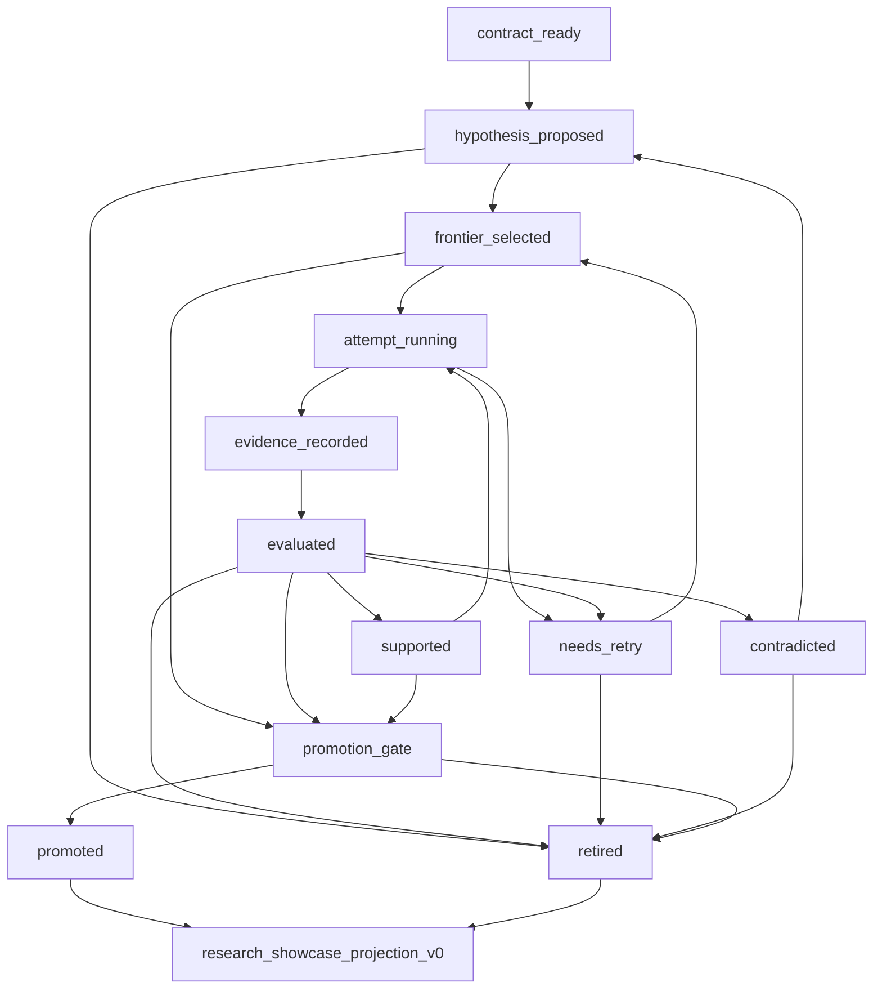

# auto_research_role_state_machine_v0

`auto_research_role_state_machine_v0` defines the always-on digital employee
model for LoopX auto research. It maps Arbor-like research roles onto LoopX's
decentralized control plane without adding a leader agent, scheduler service,
or second source of truth.

This contract answers a narrower question than the state and lane contracts:
which digital employee role may move a research item from one state to the
next, and what evidence must exist before that transition is visible to users?

## Companion Contracts

The auto-research kernel is intentionally split into three protocol surfaces:

| Contract | Owns | Does not own |
| --- | --- | --- |
| `decentralized_auto_research_state_v0` | Record and projection shapes: contract, todo-linked hypothesis, evidence event, frontier, evidence graph, showcase projection. | Which role may write each transition. |
| `auto_research_lane_contract_v1` | Capability ownership for curator, proposer, executor, evaluator, and narrator lanes. | The ordered state machine and transition evidence. |
| `auto_research_role_state_machine_v0` | Digital employee role map, state transition rules, takeover gates, and no-leader invariants. | Runtime scheduling, model prompts, or hidden orchestration. |

All three contracts are peer artifacts under `docs/reference/protocols/`.
Together they are the public-safe control-plane map for auto research.

## Digital Employee Role Map

These roles can run continuously as separate LoopX agent todos, monitors, or
Codex sessions. None owns the full graph.

| Role | Capability token | Primary job | May write | Must not |
| --- | --- | --- | --- | --- |
| Research curator | `research_curator` | Keep the objective, editable scope, protected scope, metric, and stop policy explicit. | `research_contract_v0`, protected-boundary notes, owner gate todos. | Pick winners, run experiments, or publish showcase claims. |
| Hypothesis mapper | `hypothesis_mapper` | Turn research ideas into todo-backed hypotheses with parent links and mechanism families. | `research_hypothesis_v0`, successor todos, grounding refs. | Claim novelty from the same source used to ideate. |
| Evidence runner | `evidence_runner` | Execute one selected hypothesis in an isolated worktree and preserve scored or unscored attempt evidence. | branch refs, `research_evidence_event_v0`, retry packets. | Edit protected scope, hide failures, or promote results. |
| Evidence verifier | `evidence_verifier` | Classify evidence as supported, contradicted, retry-needed, or promotion-ready. | evaluation summary, promotion candidate, retirement candidate, gate todo. | Treat dev-only lift as promoted or override missing held-out evidence. |
| Gate steward | `gate_steward` | Surface operator gates for promotion, merge, private boundary, or first-screen publication. | `operator_gate` todo/projection, gate outcome summary. | Bypass a gate or convert chat praise into write permission. |
| Synthesis narrator | `synthesis_narrator` | Render the public-safe story from projections: timeline, evidence graph, metrics, and decisions. | `research_showcase_projection_v0`, public docs/pages after applicable gates. | Invent metrics, read private source bodies, or mutate source records. |
| Frontier janitor | `frontier_janitor` | Retire stale, contradicted, duplicate, or retry-exhausted hypotheses while preserving negative evidence. | retirement candidate, successor todo, no-follow-up rationale. | Delete evidence or silently collapse failed branches. |

The role names are product-facing labels. A single Codex session may perform
multiple roles only when it has the corresponding todo claim, capability, and
write boundary; the appended record must still name the role that produced it.

## State Vocabulary

`auto_research_state_transition_v0` uses the following durable states:

| State | Meaning | Typical next states |
| --- | --- | --- |
| `contract_ready` | The objective, editable/protected scope, metric, budget, and promotion policy are public-safe and explicit. | `hypothesis_proposed` |
| `hypothesis_proposed` | A todo-backed hypothesis exists, but no agent has started its attempt. | `frontier_selected`, `retired` |
| `frontier_selected` | `quota should-run --agent-id ...` selected the hypothesis for the current agent. | `attempt_running`, `operator_gate` |
| `attempt_running` | A claimed evidence runner is working in an isolated worktree. | `evidence_recorded`, `needs_retry` |
| `evidence_recorded` | Attempt evidence exists with split, metric, branch/artifact refs, and boundary facts. | `evaluated` |
| `evaluated` | A verifier classified the evidence under the research contract. | `supported`, `contradicted`, `needs_retry`, `promotion_gate`, `retired` |
| `supported` | Dev evidence supports the direction, but promotion is not complete. | `promotion_gate`, `attempt_running`, `retired` |
| `needs_retry` | Attempt is inconclusive but resumable from a ref or clearly bounded retry. | `frontier_selected`, `retired` |
| `contradicted` | Evidence shows regression, correctness failure, or guardrail failure. | `retired`, `hypothesis_proposed` |
| `promotion_gate` | Promotion requires held-out evidence, owner decision, merge gate, or public-boundary review. | `promoted`, `retired`, `operator_gate` |
| `promoted` | Promotion policy accepted the result into the current best artifact. | `research_showcase_projection_v0` |
| `retired` | The direction is no longer active; negative evidence remains queryable. | `research_showcase_projection_v0` |

## State Machine



## Transition Rules

| Transition | Required role | Required evidence |
| --- | --- | --- |
| `contract_ready -> hypothesis_proposed` | Hypothesis mapper | `research_contract_v0`, `todo_id`, `claimed_by`, mechanism family, grounding refs or no-grounding reason. |
| `hypothesis_proposed -> frontier_selected` | LoopX quota projection | `quota should-run --agent-id ...` selected the todo and write boundary allows the attempt. |
| `frontier_selected -> attempt_running` | Evidence runner | agent claim, isolated worktree or equivalent execution boundary, protected scope reminder. |
| `attempt_running -> evidence_recorded` | Evidence runner | split label, metric status, branch/artifact ref, protected-scope clean flag, raw-private-artifact flags. |
| `evidence_recorded -> evaluated` | Evidence verifier | contract policy applied to scored or unscored evidence. |
| `evaluated -> supported` | Evidence verifier | dev evidence improves or otherwise satisfies the contract's support threshold. |
| `evaluated -> contradicted` | Evidence verifier | regression, correctness failure, boundary violation, or novelty failure. |
| `evaluated -> needs_retry` | Evidence verifier | unscored attempt with resumable ref or explicit bounded retry reason. |
| `evaluated -> promotion_gate` | Evidence verifier or gate steward | holdout candidate, clean boundary, pending owner/merge/publication decision. |
| `promotion_gate -> promoted` | Gate steward plus verifier | held-out evidence when required, clean boundary, and applicable operator gate accepted. |
| `supported|contradicted|needs_retry -> retired` | Frontier janitor | negative evidence, retry exhaustion, duplicate proof, or no-follow-up rationale. |
| `promoted|retired -> research_showcase_projection_v0` | Synthesis narrator | projection refs only; no direct mutation of source records. |

## No-Leader Invariants

- No role owns the full graph or can rewrite global research truth.
- `quota should-run --agent-id ...` selects only the current agent frontier.
- Every executable hypothesis remains backed by a `todo_id` and `claimed_by`.
- Promotion is evidence plus gate policy, not a persuasive summary.
- A narrator reads `research_showcase_projection_v0`; it does not certify
  scores or mutate source state.
- A gate steward can surface or record a decision; it cannot bypass the gate.
- Failed, contradicted, and retry-exhausted attempts stay visible as negative
  evidence unless a public/private boundary requires redaction.

## Demo And Takeover Implications

The visible auto-research demo can launch several digital employees only as a
user-visible rehearsal first. The default packet should remain `dry_run`: it
may show tmux panes, commands, and takeover controls, but it must not start
Codex, write LoopX state, or spend quota by itself.

When a user opts into the real demo, each lane still runs its own:

```bash
loopx --format json --registry "$LOOPX_REGISTRY" \
  quota should-run --goal-id "$LOOPX_GOAL_ID" --agent-id "$LOOPX_AGENT_ID"
```

and each lane reads its own auto-research frontier. The shell layout is only a
visibility and takeover surface, not a coordinator.

## Acceptance Checks

An implementation satisfies this role/state-machine contract when:

- the digital employee role map is visible to users and docs;
- state transitions name the role and evidence required to move forward;
- the smoke suite checks `auto_research_role_state_machine_v0` next to the
  state and lane contracts;
- generated demo packets expose user takeover controls before execution;
- no public artifact centralizes graph ownership in a leader, coordinator, or
  supervisor role.
