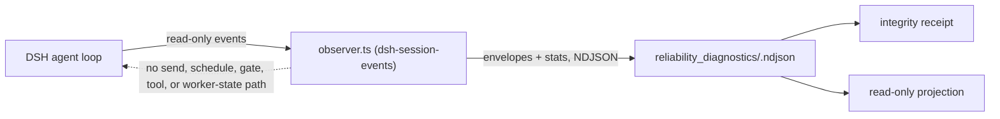

# Reliability Diagnostics

[中文](README.zh-CN.md) | [RFC](../../../docs/architecture/rfcs/long-running-agent-reliability-diagnostics-governed-delivery-v0.md)

Status: experimental, built in, default off, goal and session scoped. This
package implements the prototype components described by the RFC's **P0
roadmap phase**: the L1 shadow-observer contract and its first DSH event-source
adapter. It does **not** claim the P0 exit gate; an eligible C1 observer run,
C0 adapter-fidelity evidence, and measured overhead are still required.

An L1 observer sees a long-running agent session and writes an independent
diagnostic record about it. It may **never** influence that session. This
capability makes that promise a machine contract rather than a policy: the
envelope schema cannot express a command, the receipt records the empty set of
outbound endpoints, observer failure is counted and quarantines the evidence,
and the projection carries `mode: read_only` and `authority: none`.



The dashed edge is an asserted absence. The observer ships as its own Cordis
plugin entry with no Driver or Agent injection, consumes only session-log
publication events, and is absent from the Driver and package-root bundles.
Tests reject control-shaped fields, and the receipt turns `invalid` if any
outbound endpoint or scheduler/worker-context path appears. This is module and
hook isolation, not an OS-process-isolation claim.

## Placement Rationale

- **Capability id `reliability-diagnostics`** (built in, provider
  `loopx-core`). The caller outcome is "is this run admissible passive
  evidence, and what does it say about stage, stall, repetition, and
  recovery?" No existing capability owns diagnostics without authority.
  Session runtime is a runtime-authority projection, so the diagnostic ledger
  and projection are **siblings** of it, never merged into it. Ids are
  kebab-case like every other catalog id; the package directory is
  `reliability_diagnostics`.
- **Provider id `dsh-session-events`** (origin `extension`). It is delivered by
  the npm package `packages/dsh-loopx-plugin` through the explicit
  `dsh-loopx-plugin/observer` entry and its own `loopx-shadow-observer` Cordis
  row, separate from `driver.ts`. Because an npm plugin has no Python
  `extension.toml` lifecycle, the capability declares the provider on its
  catalog entry and the registry reports it `declared=true`,
  `installed=enabled=ready=false`. The precedent is
  `repository_change_window`, which declares its `git-hook` provider the same
  way.
- **Helpers stay local.** Ledger, receipt, and projection reducers live inside
  this package. The only shared imports are the public-safe value validator
  and the `SOURCE_ID_KEYS` identity tuple; the session-runtime substring
  classifier is deliberately not reused.

## Relationship To The RFCs

- [Long-Running Agent Reliability Diagnostics](../../../docs/architecture/rfcs/long-running-agent-reliability-diagnostics-governed-delivery-v0.md)
  owns this capability. This slice is the P0 contract checkpoint recorded in
  its roadmap; the `dsh` event source is the recorded answer to owner
  decision 2, and the C1 run, overhead report, and retention profile remain
  open before P0 exit.
- [Desktop Execution Frontends](../../../docs/architecture/rfcs/desktop-execution-frontends-v0.md)
  Mode B is the managed runtime this observer is built for: the Desktop-owned
  runtime supervisor may consume the receipt and projection as diagnostic
  inputs, while the observer keeps no supervisor authority.

## Contract

### Observer envelope (`reliability_observer_envelope_v0`)

| Field | Type | Rule |
| --- | --- | --- |
| `schema_version` | literal | `reliability_observer_envelope_v0` |
| `capability_id` | literal | `reliability-diagnostics` |
| `provider_id` | identity token | e.g. `dsh-session-events` |
| `observer_id` | identity token | stable for one observer instance and linked to stats |
| `goal_id`, `session_id` | identity token | `^[A-Za-z0-9][A-Za-z0-9_.:-]{0,120}$` |
| `agent_id` | identity token, optional | |
| `sequence` | integer >= 0 | observer-assigned, monotonic per session; gaps are counted as loss |
| `observed_at` | ISO-8601 with timezone | |
| `clock.source` | enum | `harness_event_time`, `observer_wall_clock`, `fixture` |
| `clock.uncertainty_ms` | integer >= 0 | declared, never inferred |
| `event_kind` | enum | `session_started`, `turn_started`, `turn_ended`, `step_started`, `step_ended`, `user_message`, `tool_called`, `tool_completed`, `agent_status`, `agent_pre_step`, `agent_error`, `session_disposed`, `unsupported` |
| `summary` | object | only `turn`, `step` (integers) and `reason`, `status`, `tool_name`, `error_class`, `source_event_type`, `message_source_kind` (compact tokens) |
| `source_refs` | object | only id keys: `event_id`, `event_seq`, `tool_call_id`, `message_id`, `outcome_id`, `gate_id`, `approval_id`, `artifact_id`, `run_id`, `ref_id` |

Any other field is rejected with a typed reason: `control_field_rejected`
(`command`, `send`, `prompt`, `schedule`, `retry`, `stop`, `resume`, `gate`,
`tool_call`, `worker_state`, ...), `raw_material_field_rejected`
(`transcript`, `messages`, `content`, `text`, `arguments`, `output`,
`stdout`, `stderr`, `log`, `cwd`, `token`, ...), or
`unsupported_field_rejected`. Every provider applies the equivalent recursive
public-safe value contract **before its first append**, and LoopX ingest applies
it again. Absolute local paths and credential-like tokens fail closed without
reaching ledger bytes; the producer counts them as `public_safety_violation`.

### Observer stats (`reliability_observer_stats_v0`)

Written by every observer implementation next to its envelopes. It pins
`worker_id`, `model_id`, `task_id`, `environment_id`, `tools_id`, `budget_id`,
`adapter_revision`, and `observer_revision` under `run_identity`; declares
`event_sources` and `source_fields_consumed`; and records timestamps, accepted
and rejected counts, typed rejection totals, buffer bound, drops, failures,
peak buffered events, flush attempts, clock source, outbound endpoints, and
both worker-context and scheduler-input influence flags. Counts must satisfy
`observed = accepted + rejected + dropped`, timestamps must be timezone-aware,
and every accepted envelope must link to matching provider/observer stats.
Stats are cumulative per observer instance; the receipt keeps the latest
record per `observer_id` and sums across instances.

### Integrity receipt (`reliability_integrity_receipt_v0`)

| Field | Meaning |
| --- | --- |
| `status` | `valid`, `degraded`, `quarantined`, `invalid` (total, ordered) |
| `reason_codes` | typed list; empty only when `valid` |
| `observed_event_count`, `accepted_event_count`, `persisted_event_count` | source attempts, accepted count from stats, and linked envelopes in the ledger |
| `lost_event_count`, `duplicate_sequence_count` | per-session sequence gaps and repeats |
| `ledger_invalid_record_count` | malformed or foreign records found in the ledger |
| `rejected_event_count`, `rejected_by_reason` | refusals reported by observers |
| `buffer_bound`, `backpressure_drop_count`, `observer_failure_count` | bounded-failure evidence |
| `clock.sources`, `clock.max_uncertainty_ms` | declared clocks; > 1000 ms degrades |
| `outbound_endpoints`, worker/scheduler influence flags | must be `[]` / `false` / `false` |
| `run_identities`, `event_sources`, `source_fields_consumed` | pinned treatment identity and declared adapter coverage |
| `event_kinds_consumed`, `summary_fields_consumed` | the event kinds and compact summary fields actually persisted |

Status rules: `invalid` when there are no observations, stats are absent or do
not link exactly to persisted envelopes, an identity was rejected, the ledger
contains invalid input, any outbound endpoint exists, or observation entered
worker context or scheduler inputs. Otherwise `quarantined` covers observer
failure, control-shaped input, or a producer-side `public_safety_violation`.
Event gaps, drops, duplicates, raw or unsupported fields, and excess clock
uncertainty are `degraded`; otherwise the receipt is `valid`.

### Diagnostic projection (`reliability_diagnostic_projection_v0`)

| Field | Meaning |
| --- | --- |
| `mode`, `authority`, `write_scope`, `worker_influence` | `read_only`, `none`, `diagnostic_ledger_only`, `none` |
| `stage` | `unknown`, `idle`, `running`, `tool_running`, `errored`, `disposed` from the last event kind |
| `counts` | turns started/ended, steps, tool calls, errors |
| `stall` | detected only while active and silent for `threshold_ms` (default 300000) relative to `--as-of` |
| `repetition` | longest run of consecutive identical `tool_name` calls; detected at 3 |
| `recovery` | errors followed by a later completed step or non-error turn end count as recovered |
| `signals` | `stall_suspected`, `repetition_suspected`, `unrecovered_error`, `event_loss`, `integrity_not_valid` |
| `integrity` | the receipt status and reason codes |

## Use It

```bash
# Enable the DSH provider for one predeclared goal and one exact DSH session.
export LOOPX_DSH_SHADOW_OBSERVER_GOAL_ID=<goal-id>
export LOOPX_DSH_SHADOW_OBSERVER_SESSION_ID=<session-id>
export LOOPX_DSH_SHADOW_OBSERVER_RUN_IDENTITY_JSON='{"worker_id":"<worker>","model_id":"<model>","task_id":"<task>","environment_id":"<environment>","tools_id":"<tools>","budget_id":"<budget>","adapter_revision":"<adapter-revision>","observer_revision":"<observer-revision>"}'
# Optional: LOOPX_DSH_SHADOW_OBSERVER_LEDGER_DIR, LOOPX_DSH_SHADOW_OBSERVER_BUFFER_BOUND

loopx reliability-diagnostics receipt --goal-id <goal-id> --format json
loopx reliability-diagnostics status  --goal-id <goal-id> --format json
loopx reliability-diagnostics ingest  --goal-id <goal-id> --input observer.ndjson --format json
```

The ledger lives at `<runtime-root>/reliability_diagnostics/<goal-id>.ndjson`;
the default runtime root is the same one the rest of LoopX uses and the CLI
prints only the relative `ledger_ref`. `ingest` re-validates every line. A
clean ingest is a transparent copy; any malformed or rejected input appends a
durable `reliability_ingest_violation_v0` marker, making subsequent receipts
`invalid` instead of losing the failed gate at process exit.

Unless all three required variables are valid, the observer row registers no
hooks and writes no files (feature-off parity). When enabled, `observer.ts`
observes only `session/created`, `session/event`, and `session/disposed`.
Events from any other session are rejected as `identity_invalid`, so they can
never be silently attributed to the configured goal. Token-level
`assistant/chunk` events are not consumed.

## Validation

```bash
python3 examples/reliability_diagnostics/dsh-shadow-observer-fixture-smoke.py
python3 -m pytest tests/capabilities/test_reliability_diagnostics.py tests/capabilities/test_reliability_diagnostics_dsh_provider.py -q
cd packages/dsh-loopx-plugin && pnpm typecheck && pnpm test -- observer
```

The fixture is a fixed DSH-shaped stream with one missing sequence, one event
stamped with 1500 ms clock uncertainty, one raw-material-bearing record, and a
burst that overflows a 20-record buffer. Its receipt is `degraded` with exactly
`sequence_gap`, `backpressure_drop`, `raw_material_rejected`, and
`clock_uncertainty_exceeded`; the projection reports repetition on `read`, one
recovered error, and no stall.

## Non-Goals In This Slice

No dashboard surface, no L2 recommendations, no automatic recovery, no
writeback into goals, todos, gates, or session runtime, and no change to the
`loopx status` first screen. The adapter requires an externally pinned
goal/session/run identity; it does not discover bindings through the Driver or
LoopX CLI. This prototype also does not provide matched native/L1 execution,
observer CPU/I/O/latency/storage measurement, or an eligible C1 run.
